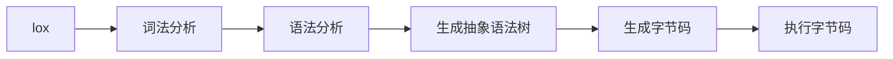

## 解释器执行 lox 代码的流程


## 词法分析

词法分析是将源代码转换为 token 流的过程。lox 语言的 token 有以下几种：
- `(`, `)`, `{`, `}`, `,`, `.`, `;`
- `+`, `-`, `*`, `/`
- `!`, `!=`, `=`, `==`, `>`, `>=`, `<`, `<=`
- `and`, `class`, `else`, `false`, `fun`, `for`, `if`, `nil`, `or`, `print`, `return`, `super`, `this`, `true`, `var`, `while`
- `identifier`
- `number`
- `string`
- `EOF`
- `error`
- `comment`
- `whitespace`

## 语法分析

语法分析是将 token 流转换为抽象语法树的过程。lox 语言的语法规则如下：

```ebnf
program        → declaration* EOF ;

declaration    → classDecl
               | funDecl
               | varDecl
               | statement ;

classDecl      → "class" IDENTIFIER
                ( "<" IDENTIFIER )?
                "{" function* "}" ;

funDecl        → "fun" function ;

function       → IDENTIFIER "(" parameters? ")" block ;

parameters     → IDENTIFIER ( "," IDENTIFIER )* ;

varDecl        → "var" IDENTIFIER ( "=" expression )? ";" ;

statement      → exprStmt
               | forStmt
               | ifStmt
               | printStmt
               | returnStmt
               | whileStmt
               | block ;

exprStmt       → expression ";" ;
forStmt        → "for" "(" ( varDecl | exprStmt | ";" )
               expression? ";"
               expression? ")" statement ;

ifStmt         → "if" "(" expression ")" statement ( "else" statement )? ;

printStmt      → "print" expression ";" ;

returnStmt     → "return" expression? ";" ;

whileStmt      → "while" "(" expression ")" statement ;

block          → "{" declaration* "}" ;

expression     → assignment ;

assignment     → ( call "." )? IDENTIFIER "=" assignment
               | logic_or ;

logic_or       → logic_and ( "or" logic_and )* ;

logic_and      → equality ( "and" equality )* ;

equality       → comparison ( ( "!=" | "==" ) comparison )* ;

comparison     → addition ( ( ">" | ">=" | "<" | "<=" ) addition )* ;

addition       → multiplication ( ( "-" | "+" ) multiplication )* ;

multiplication → unary ( ( "/" | "*" ) unary )* ;

unary          → ( "!" | "-" ) unary
               | call ;

call           → primary ( "(" arguments? ")" | "." IDENTIFIER )* ;

arguments      → expression ( "," expression )* ;

primary        → "true" | "false" | "nil" | "this"
               | NUMBER | STRING | IDENTIFIER
               | "(" expression ")" ;

```

## 生成抽象语法树

抽象语法树是一种树形结构，用于表示程序的语法结构。lox 语言的抽象语法树节点有以下几种：

- `Binary`：二元表达式
- `Grouping`：分组表达式
- `Literal`：字面量表达式
- `Unary`：一元表达式
- `Variable`：变量表达式
- `Assign`：赋值表达式
- `Logical`：逻辑表达式
- `Call`：函数调用表达式
- `Get`：属性访问表达式
- `Set`：属性赋值表达式
- `This`：this 表达式
- `Super`：super 表达式
- `Function`：函数表达式
- `Return`：返回表达式
- `Class`：类表达式
- `Block`：块表达式
- `Expression`：表达式语句
- `Print`：打印语句
- `Var`：变量声明语句
- `If`：if 语句
- `While`：while 语句
- `For`：for 语句
- `Break`：break 语句
- `Continue`：continue 语句
- `Function`：函数声明语句
- `Error`：错误语句
- `Empty`：空语句
- `Block`：块语句

## 生成字节码

字节码是一种中间表示形式，用于表示程序的执行逻辑。lox 语言的字节码指令有以下几种：

- `OP_CONSTANT`：将常量推入栈顶
- `OP_NIL`：将 nil 值推入栈顶
- `OP_TRUE`：将 true 值推入栈顶
- `OP_FALSE`：将 false 值推入栈顶
- `OP_POP`：弹出栈顶元素
- `OP_GET_LOCAL`：获取局部变量
- `OP_SET_LOCAL`：设置局部变量
- `OP_GET_GLOBAL`：获取全局变量
- `OP_DEFINE_GLOBAL`：定义全局变量
- `OP_SET_GLOBAL`：设置全局变量
- `OP_EQUAL`：比较相等
- `OP_GREATER`：比较大于
- `OP_LESS`：比较小于
- `OP_ADD`：加法运算
- `OP_SUBTRACT`：减法运算
- `OP_MULTIPLY`：乘法运算
- `OP_DIVIDE`：除法运算
- `OP_NOT`：逻辑非运算
- `OP_NEGATE`：取负运算
- `OP_PRINT`：打印栈顶元素
- `OP_JUMP`：无条件跳转
- `OP_JUMP_IF_FALSE`：条件跳转
- `OP_LOOP`：循环跳转
- `OP_CALL`：调用函数
- `OP_RETURN`：返回值
- `OP_CLASS`：定义类
- `OP_METHOD`：定义方法
- `OP_INVOKE`：调用方法
- `OP_GET_PROPERTY`：获取属性
- `OP_SET_PROPERTY`：设置属性
- `OP_INHERIT`：继承类
- `OP_GET_SUPER`：获取父类
- `OP_SUPER_INVOKE`：调用父类方法
- `OP_CLOSE_UPVALUE`：关闭上值
- `OP_CLOSURE`：创建闭包
- `OP_GET_UPVALUE`：获取上值
- `OP_SET_UPVALUE`：设置上值
- `OP_GET_PROPERTY`：获取属性
- `OP_SET_PROPERTY`：设置属性


## 执行字节码

