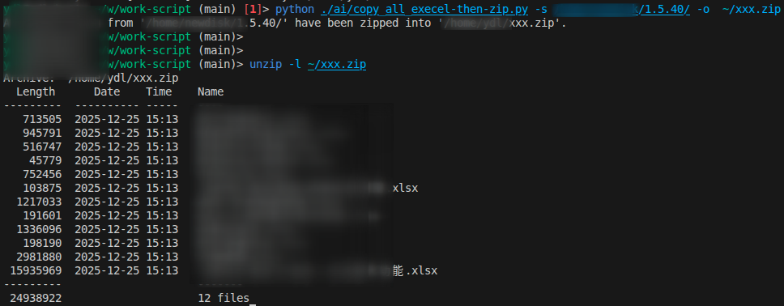

# 用 AI 快速编写 Python 工具脚本：Excel 打包 ZIP

我的理念是：`能用脚本解决的事情就不手动操作，尤其是重复性工作`。随着 AI 的出现，这个理念得到了进一步的强化：`能用 AI 辅助编写脚本的事情，就不再完全靠自己手写`。

手里有一个简单的需求：将目录下的所有 Excel 文件打包成 zip 文件。传统的做法是手动编写脚本，然后运行脚本完成任务。现在我尝试用 AI 来帮我完成这个任务。

## 工作环境

我使用的编辑器是 VS Code，并安装了 GitHub Copilot 插件。
Python 版本是 3.11，
操作系统是 Ubuntu 22.04。

我将用 AI 来编写一个 Python 脚本，实现将指定目录下的所有 Excel 文件打包成 zip 文件。

## 文件头部编写注释，描述脚本功能

我在脚本开头编写了注释，用来描述脚本的功能和使用方法。这有助于 AI 理解我要实现的功能。

```python
# Given a directory containing multiple Excel files, 
# copy them to a temp directory and then zip them.
```

## 编写方法名，使用 AI 补全方法体

我将功能拆分成两个方法，一个是参数解析方法 `parse_arguments`，另一个是主逻辑方法 `copy_excel_and_zip`。我先写方法名，然后让 AI 帮我补全方法体。

AI 发展的速度非常快，几乎可以实时生成代码。我只需要稍微调整 AI 生成的代码，就能得到我想要的结果。更直观的感受是，它的生成速度已经超过了传统自动补全的提示体验。

### parse_arguments 方法用于解析命令行参数，获取源目录和输出 zip 文件路径

```python
@dataclass
class CopyExcelArgs:
    source: str
    output: str


def parse_arguments() -> CopyExcelArgs:
    parser = argparse.ArgumentParser(
        description="Copy all Excel files from a directory and zip them."
    )
    parser.add_argument(
        "-s",
        "--source",
        type=str,
        required=True,
        help="Source directory containing Excel files",
    )
    parser.add_argument(
        "-o", "--output", type=str, required=True, help="Output zip file path"
    )
    args = parser.parse_args()
    return CopyExcelArgs(source=args.source, output=args.output)
```

### copy_excel_and_zip 方法用于实现复制 Excel 文件并打包成 zip 文件的逻辑

```python
def copy_excel_and_zip(source_dir: str, output_zip: str):
    excel_extensions = {".xls", ".xlsx", ".xlsm", ".xlsb", ".odf", ".ods", ".odt"}

    with tempfile.TemporaryDirectory() as temp_dir:
        temp_path = Path(temp_dir)

        # Copy Excel files to temp directory
        for root, _, files in os.walk(source_dir):
            for file in files:
                if Path(file).suffix.lower() in excel_extensions:
                    src_file_path = Path(root) / file
                    shutil.copy2(src_file_path, temp_path / file)

        # Create a zip file from the temp directory
        with zipfile.ZipFile(output_zip, "w", zipfile.ZIP_DEFLATED) as zipf:
            for file in temp_path.iterdir():
                zipf.write(file, arcname=file.name)

    print(f"All Excel files from '{source_dir}' have been zipped into '{output_zip}'.")
```

### 编写主函数，调用方法
```python
if __name__ == "__main__":
    args = parse_arguments()
    copy_excel_and_zip(args.source, args.output)
```

### 导入所需模块

至于导入的模块，我让 AI 根据方法体自动补全。这里是补全后的代码。

```python
import os
import shutil
import tempfile
import zipfile
from pathlib import Path
import argparse
from dataclasses import dataclass
```



## 总结

- AI 的发展已经超出我的预期，而且能够实时生成代码，极大地提升了编程效率。
- 通过编写注释和方法名，AI 能够理解我要实现的功能，并生成相应的代码。
- 在尝试简单的编写脚本任务后，接下来我想尝试一下更复杂的任务，比如用 AI 帮我编写一个自动化测试脚本。或者在业务中实践一些更加复杂的功能开发工作。