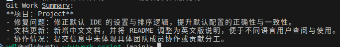

# 用 AI 总结 Git 提交，自动生成工作总结

如果你的工作需要写日报或者周报，这个工具就是你的福音：可以帮你提取 Git 日志并自动生成总结内容。

其原理是通过提取 `git log`，然后使用 AI 模型对日志内容进行总结，生成一段简洁的总结文本。

虽然我没有这个日报或者周报这种需求，但是使用这个工具可以帮我快速了解某个项目在最近一段时间内的工作内容，方便我进行项目管理和跟踪。当一个练手的工具。

废话不多说，直接上代码。

## 参数解析

- `-u/--username`：Git 用户名，用于过滤提交记录。
- `-e/--email`：Git 邮箱，可选参数。
- `-p/--projects`：项目目录列表，指定需要提取日志的项目路径。
- `-d/--days`：回溯的天数，默认是 1 天。

```python
from openai import OpenAI
from typing import List
import subprocess
from datetime import datetime, timedelta
import argparse
from dataclasses import dataclass
import os


@dataclass
class GitWorkSummaryArgs:
    username: str
    email: str
    projects: List[str]
    last_days: int = 1


def parse_arguments() -> GitWorkSummaryArgs:
    parser = argparse.ArgumentParser(description="Summarize today's git work.")
    parser.add_argument(
        "-u", "--username", type=str, required=True, help="Git username"
    )
    parser.add_argument(
        "-e", "--email", type=str, required=False, default="", help="Git email"
    )
    parser.add_argument(
        "-p",
        "--projects",
        type=str,
        nargs="+",
        required=True,
        help="List of project directories to summarize git work from",
    )
    parser.add_argument(
        "-d",
        "--days",
        type=int,
        default=1,
        help="Number of days to look back for commits",
    )
    args = parser.parse_args()
    return GitWorkSummaryArgs(
        username=args.username,
        email=args.email,
        projects=args.projects,
        last_days=args.days,
    )
```

## 系统提示词

```python
SYSTEM_PROMPT = """You are a helpful assistant that summarizes git commit messages into concise summaries and key points.
1. please return chinese.
2. Focus on the main tasks accomplished, features added, bugs fixed, and any significant changes.
3. Structure the summary with bullet points for clarity.
4. Keep the summary brief and to the point.
5. Avoid technical jargon unless necessary.
6. Highlight any collaborative efforts or important contributions from team members.
7. Ensure the summary is easy to understand for stakeholders who may not be familiar with technical details.
8. Use a professional and neutral tone.
9. distinguish projects if multiple projects are provided.
"""
```

## 提取 git 的日志

- `get_git_commit_messages`：提取指定项目在指定时间范围内的 Git 提交消息。
- 参数：
  - `args`：包含用户名、项目列表和回溯天数的参数对象。
  - 返回值：包含每个项目提交消息的字典，键为项目名称，值为提交消息列表。

```python
def get_git_commit_messages(args: GitWorkSummaryArgs) -> dict[str, List[str]]:
    commit_messages = {}
    last_days = args.last_days
    last_day_format = (datetime.now() - timedelta(days=last_days)).strftime("%Y-%m-%d")

    for project in args.projects:
        # pull the latest changes
        project_name = os.path.basename(project)
        print(f"Processing project: {project_name} at {project}")
        subprocess.run(["git", "-C", project, "pull"], check=True)
        try:
            cmd = [
                "git",
                "-C",
                project,
                "log",
                "--since={}".format(last_day_format),
                "--pretty=format:%s",
            ]
            if args.username:
                cmd.extend(["--author={}".format(args.username)])
            print(f"Running command: {' '.join(cmd)}")
            result = subprocess.run(cmd, capture_output=True, text=True, check=True)
            messages = result.stdout.strip()
            if len(messages) == 0:
                print(f"No commits found for {project} since {last_day_format}.")
                continue
            print(f"Commits from {project} since {last_day_format}: {messages}")
            commit_messages[project_name] = messages.split("\n")
        except subprocess.CalledProcessError as e:
            print(f"Error retrieving commits from {project}: {e}")
    return commit_messages
```

## 生成总结内容

- `summarize_git_work`：使用 AI 模型生成总结内容。
- 参数：
  - `last_days`：回溯的天数。
  - `commit_messages`：包含每个项目提交消息的字典。
  - 返回值：生成的总结文本。
- `summarize_git_work` 使用 OpenAI 的 GPT-5.2 模型来生成总结内容。

```python
def summarize_git_work(last_days, commit_messages: dict[str, List[str]]) -> str:
    client = OpenAI()
    prompt = f"Here are the git commit messages from the last {last_days} days:\n\n"
    for project, messages in commit_messages.items():
        prompt += f"Project: {project}\n"
        for msg in messages:
            prompt += f"- {msg}\n"
    prompt += (
        f"\nPlease provide a concise summary and key points of the work done in the last {last_days} days."
    )
    response = client.chat.completions.create(
        model="gpt-5.2-2025-12-11",
        messages=[
            {"role": "system", "content": SYSTEM_PROMPT},
            {"role": "user", "content": prompt},
        ],
    )

    summary = response.choices[0].message.content.strip()
    return summary
```

## 主函数

```python
if __name__ == "__main__":
    args = parse_arguments()
    sample_commits = get_git_commit_messages(args)
    if not sample_commits:
        print(f"No git commits found for the last {args.last_days} days.")
    else:
        summary = summarize_git_work(args.last_days, sample_commits)
        print("Git Work Summary:")
        print(summary)
```

## 执行命令

```bash
python ai/summary-git-work.py -u d -p /home/newdisk/workspace/d-gitx-feat-1.2.3-main/ -d 20
```

