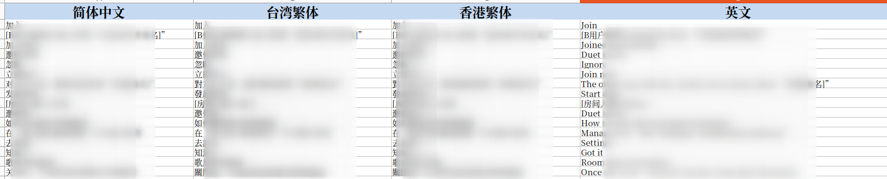
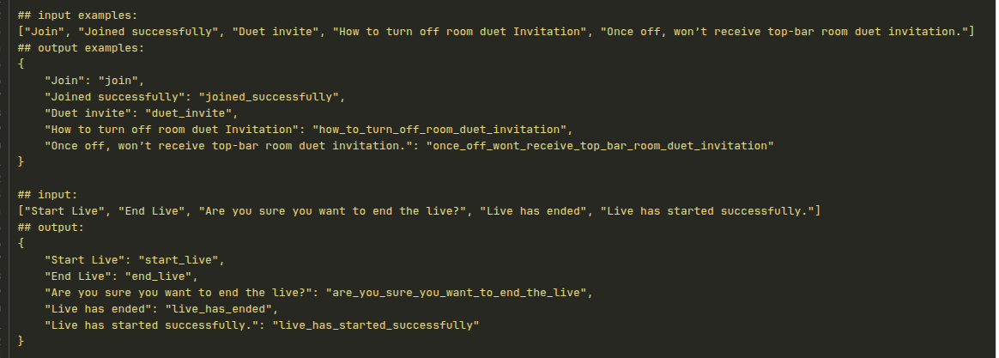
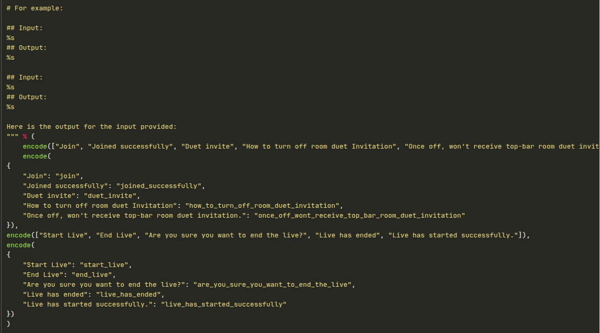
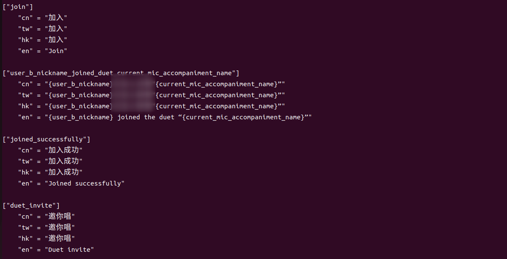
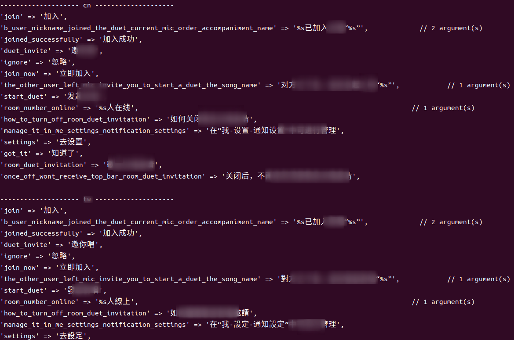

# AI 自动生成多语言 i18n Key：Excel 转结构化代码

## 需求

读取 Excel 中的多语言数据，转化为代码所需要的数据结构，一般是 key-value 结构。  

第一个版本的实现没有依赖 AI 生成，直接使用英文的翻译，去掉所有的符号，唯一的缺点就是，英文翻译过长的话，字典的 key 会变得特别长，体验不友好。  

还有一个问题，翻译中嵌套着中文的变量，单凭程序是无法处理这些变量的。

AI 就不同了，我们提取出这些中文的变量，交给 AI，让它先翻译为英文，然后再精简翻译（`If keywords is Chinese, translate them to English first before generating the key.`）



## 提示词

编写提示词一般选择用英文表达，然后让 AI 翻译成你需要的语言
提示词需要包含输入与输出的例子，最好是能举出一个及以上的例子，确保 AI 能准确的理解你的需求

1. 我需要 AI 返回 JSON 结构，那么我需要强调 `Provide the output in JSON format, where each English phrase maps to its corresponding short key.`
2. Map 的 key 只能由字母、数字和下划线组成 `Only use lowercase letters, numbers, and underscores.`
3. 确保 key 唯一 `Ensure the key is unique and descriptive enough to identify the phrase in different languages`

```markdown
You are a helpful assistant that extracts short keys from English phrases for internationalization (i18n) purposes. 
Given an English phrase, generate a concise, lowercase key by replacing spaces and special characters with underscores. 

Ensure the key is unique and descriptive enough to identify the phrase in different languages.

If keywords is Chinese, translate them to English first before generating the key.

Don't include any special characters, punctuation, or uppercase letters in the keys.
Only use lowercase letters, numbers, and underscores.

# For example:

## Input:
%s
## Output:
%s

## Input:
%s
## Output:
%s

Here is the output for the input provided:
```


## 最初的示例 

输入和输出的例子都是 JSON，这样做的话会增加 Token 的消耗数量



## 使用 toon_format 压缩 Token

JSON 虽然消耗的 Token 数量不多，本着程序优化的原则，还是使用了 toon_format 对 JSON 进行了压缩

toon_format 提供了两个方法：encode、decode，十分方便，类似于 JSON 的编码解码（dumps、loads）。



## 效果展示

### 生成 toml

```toml
["room_population_online"]
    "cn" = "{room_population}人在线"
    "tw" = "{room_population}人線上"
    "hk" = "{room_population}人在線"
    "en" = "{room_population} online"
```



### 生成 PHP 字典的 key

```php
[
    'room_number_online' => '%s人在线',     // 1 argument(s)
]
```



## 总结

1. 要让 AI 理解你的意思，你就要给它一些案例
2. 结构化的响应数据更利于程序解析，输入可以是人类易懂的，但是输出需要“程序易懂的”（易解析的）