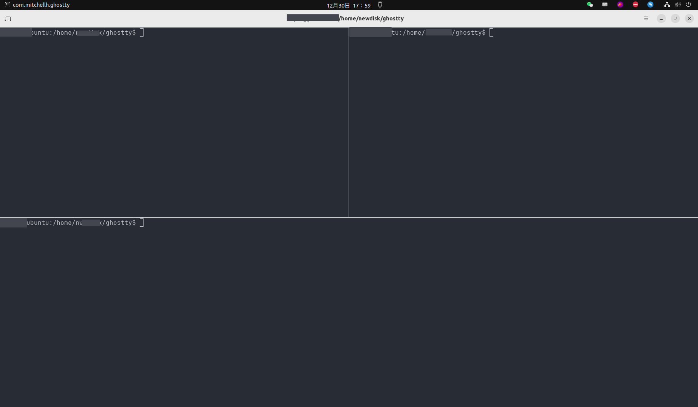

# Ubuntu 下手动编译 Linux 终端工具 Ghostty


抱着好玩的心态，想在 Ubuntu 上试用一下 Ghostty 终端工具。官方未提供二进制程序下载，但是提供了 [Linux 编译安装指南 Build From Source](https://ghostty.org/docs/install/build)

Ghostty 是通过 Zig 编写的，所以需要先安装 Zig 编译器。安装 snap，然后通过 snap 安装 Zig。[Zig 安装指南](https://github.com/ziglang/zig/wiki/Install-Zig-from-a-Package-Manager#ubuntu-snap)


```bash
snap install zig --classic --beta
```

安装好 Zig 后，就可以开始编译 Ghostty 了。

## 编译安装

### 下载源码

```bash
git clone git@github.com:ghostty-org/ghostty.git
cd ghostty

zig build -Doptimize=ReleaseFast
```

如果直接运行 `zig build`，会报错：

```bash
warning: pkg-config had errors:
Package gtk4 was not found in the pkg-config search path.
Perhaps you should add the directory containing `gtk4.pc'
to the PKG_CONFIG_PATH environment variable
No package 'gtk4' found

warning: pkg-config: Exited with code 1
error: Unexpected
/home/newdisk/ghostty/build.zig:146:17: 0x117a4c6 in build (build)
                return error.Unexpected;
                ^
/snap/zig/11625/lib/std/Build.zig:2117:24: 0x113f0a7 in runBuild__anon_8858 (build)
        .ErrorUnion => try build_zig.build(b),
                       ^
/snap/zig/11625/lib/compiler/build_runner.zig:301:9: 0x113a3cf in main (build)
        try builder.runBuild(root);
        ^
error: the following build command failed with exit code 1:
```

这是因为缺少 gtk4 的依赖，需要安装 gtk4 的开发包。

```bash
sudo apt install libgtk-4-dev libadwaita-1-dev git
```

安装好依赖后，再次运行 `zig build -Doptimize=ReleaseFast`，就可以成功编译了。

## 启动 Ghostty

```bash
chmod +x zig-out/bin/ghostty

./zig-out/bin/ghostty
```

## 查看效果



## 终端集成了 Bash、Zsh、Fish、Elvish

| Shell   | Integration                                         |
|:----:|:---- |
|bash |	${GHOSTTY_RESOURCES_DIR}/shell-integration/bash/ghostty.bash |
|fish	| "$GHOSTTY_RESOURCES_DIR"/shell-integration/fish/vendor_conf.d/ghostty-shell-integration.fish |
| zsh |	${GHOSTTY_RESOURCES_DIR}/shell-integration/zsh/ghostty-integration |
| elvish |	${GHOSTTY_RESOURCES_DIR}/shell-integration/elvish/lib/ghostty-integration.elv |

设置默认终端为 Fish

```bash
cat ~/.config/ghostty/config
shell-integration = fish
```

修改之后重新启动 Ghostty，就可以在终端日志中看到 Fish 的集成信息。

```bash
info(io_exec): found Ghostty resources dir: /home/newdisk/ghostty/zig-out/share/ghostty
info(io_exec): shell integration automatically injected shell=termio.shell_integration.Shell.fish
```

## 感受

Ghostty 是一个很有趣的终端工具，可以分屏，比 Ubuntu 自带的终端要强一些，集成了多种 Shell，可以让用户自由选择。但是目前还是一个早期版本，功能还不够完善，有些功能还不够稳定。不过，作为一个开源项目，相信未来会越来越好。

