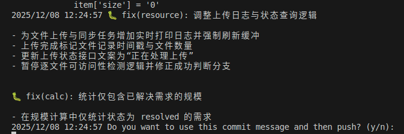

# gitx 增强 Git 功能：AI 智能生成 Commit 信息

在现代软件开发中，Git 提交信息的质量直接影响着代码版本管理的效率和团队协作的顺畅度。然而，许多开发者在日常工作中常常面临这样的困境：任务繁重、时间紧迫，导致提交信息草率潦草，甚至只是简单的"update"或"fix bug"。这不仅降低了代码库的可维护性，也给后期的代码审查和问题追溯带来了巨大挑战。

## 为什么需要 AI 自动生成提交信息？

传统的手动编写提交信息存在以下痛点：

- **时间成本高**：每次提交都需要思考如何准确描述改动内容
- **描述不准确**：在疲劳状态下容易遗漏关键改动或描述不清
- **格式不统一**：团队成员的提交信息风格各异，缺乏规范
- **缺乏上下文**：简单的描述无法反映代码改动的真实意图

gitx 工具通过集成 AI 能力，能够自动分析代码变更并生成规范、准确的提交信息，极大地提升了开发效率和代码管理质量。

## AI Commit 实现原理

gitx 的 AI 提交信息生成功能采用以下工作流程：

1. **获取代码变更**：通过 `git diff --cached` 命令获取已暂存的代码变动记录
2. **构建提示词**：将精心设计的提示词（Prompt）与 diff 信息组合
3. **调用 AI 接口**：支持 OpenAI、元宝、豆包、Gemini 等多个 AI 服务商
4. **生成提交信息**：AI 分析代码变更后返回规范的提交消息
5. **自动提交**：执行 `git commit -m "ai commit msg"` 完成代码提交

这种智能化的工作流程不仅节省时间，还能确保提交信息的准确性和一致性。



## 提示词设计：简洁实用版

一个高质量的提示词是 AI 生成准确提交信息的关键。以下是经过实践验证的简洁版提示词设计：

```markdown
你是一个资深的代码提交信息生成助手，能够根据 git diff 内容生成简洁且准确的中文提交信息。
请严格按照以下要求生成提交信息：
1. 将以下 git diff，联系上下文信息，总结为一行或者多行中文提交消息，如果有多个内容的提交，请用列出 1,2,3,4 点等，换行分隔
2. 注意根据内容仅给提交消息添加一个前缀 (feat|test|revert|chore|style|refactor|fix):等，后面的任何内容不需要添加
3. 注意 diff 内容中，每行前缀 "+++" 表示新增，前缀 "---" 表示删除，前缀 " " 表示未改动
4. 仅总结代码改动的行，可以联系上下文，不要添加多余的内容
5. 忽略新增或者删除注释，空行，格式化等无意义，多余，不必要的改动
6. 没有内容可以总结时，回复 "style: 格式化代码"
7. 最后对总结的提交消息列表进行去重，重新编号，确保每一行内容大概意思不重复
8. 返回内容去掉 diff 信息，不能包含 diff 的代码
9. 只需要总结出一个前缀 (feat|test|revert|chore|style|refactor|fix):开头的提交消息，不能再内容中添加多余的 (feat|test|revert|chore|style|refactor|fix):前缀
10. 提交消息内容使用中文描述，越简洁越好
```

### 提示词设计要点

这个简洁版提示词的核心优势：

- **明确输出格式**：要求使用标准的提交类型前缀（feat、fix、refactor 等）
- **智能内容过滤**：自动忽略注释、空行、格式化等无意义的改动
- **去重优化**：确保生成的提交信息不包含重复内容
- **中文描述**：使用中文更符合国内团队的使用习惯
- **成本控制**：提示词长度适中，降低 API 调用成本

## 提示词设计：专业详细版

对于追求更高质量提交信息的团队，可以参考 GitHub 社区的专业提示词方案。这份提示词遵循 Conventional Commits 规范，并集成了 Gitmoji 表情符号系统。

以下是核心部分的展示，[完整版本请参考 Git Commit Message Guide](https://github.com/theorib/git-commit-message-ai-prompt/blob/main/prompts/conventional-commit-with-gitmoji-ai-prompt.md)。

```markdown
## Output Format

### Single Type Changes


<emoji> <type>(<scope>): <description>
<BLANK LINE>
[optional <body>]
<BLANK LINE>
[optional <footer(s)>]

...

## Type Reference

| Type     | Title                    | Emoji | Description                                                                                            | Example Scopes (non-exaustive)                                |
| -------- | ------------------------ | ----- | ------------------------------------------------------------------------------------------------------ | ------------------------------------------------------------- |
| build    | Builds                   | 🏗️    | Changes that affect the build system or external dependencies                                          | gulp, broccoli, npm                                           |
| chore    | Chores                   | 🔧    | Other changes that don't modify src or test files                                                      | scripts, config                                               |
| ci       | Continuous Integrations  | 👷    | Changes to our CI configuration files and scripts                                                      | Travis, Circle, BrowserStack, SauceLabs,github actions, husky |
| docs     | Documentation            | 📝    | Documentation only changes                                                                             | README, API                                                   |
| feat     | Features                 | ✨    | A new feature                                                                                          | user, payment, gallery                                        |
| fix      | Bug Fixes                | 🐛    | A bug fix                                                                                              | auth, data                                                    |
| perf     | Performance Improvements | ⚡️   | A code change that improves performance                                                                | query, cache                                                  |
| refactor | Code Refactoring         | ♻️    | A code change that neither fixes a bug nor adds a feature                                              | utils, helpers                                                |
| revert   | Reverts                  | ⏪️   | Reverts a previous commit                                                                              | query, utils,                                                 |
| style    | Styles                   | 💄    | Changes that do not affect the meaning of the code (white-space, formatting, missing semi-colons, etc) | formatting                                                    |
| test     | Tests                    | ✅    | Adding missing tests or correcting existing tests                                                      | unit, e2e                                                     |
| i18n     |                          | 🌐    | Internationalization                 
```

### 两种提示词方案对比

| 对比维度 | 简洁版 | 专业详细版 |
|---------|--------|-----------|
| **提示词长度** | 短，约 300 字 | 长，约 2000+ 字 |
| **Token 消耗** | 低，成本友好 | 高，但输出质量更好 |
| **输出格式** | 基础规范 | 完整的 Conventional Commits + Gitmoji |
| **适用场景** | 中小型项目、个人开发 | 大型团队、开源项目 |
| **学习成本** | 低 | 中等 |
| **可读性** | 良好 | 优秀（包含表情符号） |

**选择建议**：
- 如果追求成本效益和快速上手，选择简洁版
- 如果注重提交信息的专业性和可读性，选择详细版
- 可以先使用简洁版，待团队熟悉后再升级到详细版

## 核心代码实现

```go
if os.Getenv("OPENAI_API_KEY") == "" {
    warningLog("OPENAI_API_KEY environment variable is not set.")
    return
}
diff := execCommandWithOutput("git", "diff", "--cached")
if diff == "" {
    warningLog("use `git add .` first")
    errLog("No changes detected.")
} else if len(diff) > limitedLen {
    warningLog(fmt.Sprintf("diff is too large (>%d characters), please commit manually", limitedLen))
    errLog("Diff too large.")
}
sp := defaultPrompt
var isGithub bool
if len(args) > 0 && args[0] == "github" {
    sp = githubPrompt
    isGithub = true
}
userMessage := "以下是 git diff 内容：\n" + diff
client := openai.NewClient() // defaults to os.LookupEnv("OPENAI_API_KEY")
chatCompletion, err := client.Chat.Completions.New(context.Background(), openai.ChatCompletionNewParams{
    Messages: []openai.ChatCompletionMessageParamUnion{
        openai.SystemMessage(sp),
        openai.UserMessage("正文内容一律使用中文"),
        openai.UserMessage(userMessage),
    },
    Model: openai.ChatModelGPT5_1,
})
if err != nil {
    errLog("OpenAI API error: %v", err)
}
commitMsg := strings.TrimSpace(chatCompletion.Choices[0].Message.Content)
log.Println(commitMsg)
```

### 代码实现解析

上述代码展示了完整的 AI Commit 工作流程：

1. **环境检查**：验证 `OPENAI_API_KEY` 是否已配置
2. **获取变更**：通过 `git diff --cached` 获取已暂存的文件变更
3. **差异校验**：
   - 检查是否有暂存的改动
   - 限制 diff 长度，防止 Token 超限和成本过高
4. **提示词选择**：支持默认提示词和 GitHub 风格提示词
5. **AI 调用**：使用 OpenAI API 生成提交信息
6. **错误处理**：完善的异常捕获和日志记录

### 自动提交与推送

生成提交信息后，gitx 会自动完成提交和推送操作：

```go
// formatCommitMessage 将多行提交信息格式化为 git commit 参数
// 例如：commit -m line1 -m line2 -m line3
commitArgs := formatCommitMessage(commitMsg, isGithub)
execCommand("git", commitArgs...)
successLog("Committed with AI-generated message.")
execCommand("git", "push")
successLog("Pushed to remote repository.")
```

这种设计使得多行提交信息能够被正确解析，每一行都作为独立的 `-m` 参数传递给 Git，确保提交信息的格式完整性。


## 最佳实践建议

### 1. API 密钥管理

```bash
# 在环境变量中配置 API 密钥
export OPENAI_API_KEY="your-api-key-here"

# 或添加到 ~/.bashrc 或 ~/.zshrc 中持久化配置
echo 'export OPENAI_API_KEY="your-api-key-here"' >> ~/.bashrc
```

### 2. 成本优化策略

- **控制 diff 大小**：大型变更建议拆分为多个小提交
- **选择合适的模型**：简单场景可使用 GPT-3.5，复杂场景使用 GPT-4
- **本地缓存**：对相似的 diff 可以缓存 AI 响应，减少重复调用

### 3. 提交信息规范化

建议团队统一遵循以下提交类型：

| 提交类型 | 使用场景 | 示例 |
|---------|---------|------|
| `feat` | 新功能开发 | feat: 添加用户登录功能 |
| `fix` | Bug 修复 | fix: 修复登录页面验证码不显示问题 |
| `refactor` | 代码重构 | refactor: 优化数据库查询性能 |
| `docs` | 文档更新 | docs: 更新 API 使用文档 |
| `test` | 测试相关 | test: 添加用户模块单元测试 |
| `chore` | 构建或辅助工具 | chore: 升级依赖包版本 |
| `style` | 代码格式调整 | style: 格式化代码 |

## 提示词优化技巧

### 关键要素

1. **明确输出格式**：详细说明期望的提交信息结构
2. **提供示例**：包含正面和负面示例帮助 AI 理解
3. **上下文说明**：解释 diff 中符号的含义（+++、---、空格）
4. **过滤规则**：明确哪些改动应该被忽略
5. **语言要求**：指定使用中文或英文

### 迭代优化

提示词不是一成不变的，应该根据实际使用效果持续优化：

- **收集反馈**：记录 AI 生成的不准确案例
- **调整规则**：针对常见问题添加特定规则
- **A/B 测试**：对比不同提示词的效果
- **团队共识**：定期与团队讨论并更新标准

## 总结与展望

### 核心优势

通过对比分析两种提示词方案，我们可以得出以下结论：

**简洁版提示词的优势：**
- ✅ Token 消耗少，成本低廉
- ✅ 快速上手，学习成本低
- ✅ 适合个人开发者和中小型项目

**专业详细版提示词的优势：**
- ✅ 输出质量更高，格式更规范
- ✅ 包含丰富的示例和说明
- ✅ 支持 Gitmoji 表情符号，提升可读性
- ✅ 适合大型团队和开源项目

### 实践价值

AI 生成提交信息的价值不仅在于节省时间，更在于：

1. **提升质量**：AI 能够更客观、全面地分析代码变更
2. **统一规范**：确保整个团队的提交信息风格一致
3. **降低门槛**：新手也能写出规范的提交信息
4. **知识沉淀**：规范的提交历史是宝贵的项目文档

### 未来展望

随着 AI 技术的发展，未来的代码提交工具可能会具备：

- **智能分类**：自动识别提交类型（feature、bugfix、refactor 等）
- **影响分析**：预测代码变更对系统的潜在影响
- **关联推荐**：建议相关的 Issue 或 PR 引用
- **代码审查**：提供基础的代码质量建议
- **多语言支持**：根据项目配置自动切换提交信息语言

gitx 的 AI Commit 功能正是朝着这个方向迈出的重要一步，它不仅是一个工具，更是一种提升代码管理效率的新思路。

---

**相关阅读：**
- [Git Commit Message 最佳实践](https://github.com/theorib/git-commit-message-ai-prompt)
- [Conventional Commits 规范](https://www.conventionalcommits.org/)
- [Gitmoji 使用指南](https://gitmoji.dev/)

**项目地址：** [gitx - GitHub](https://github.com/deliangyang/gitx) 