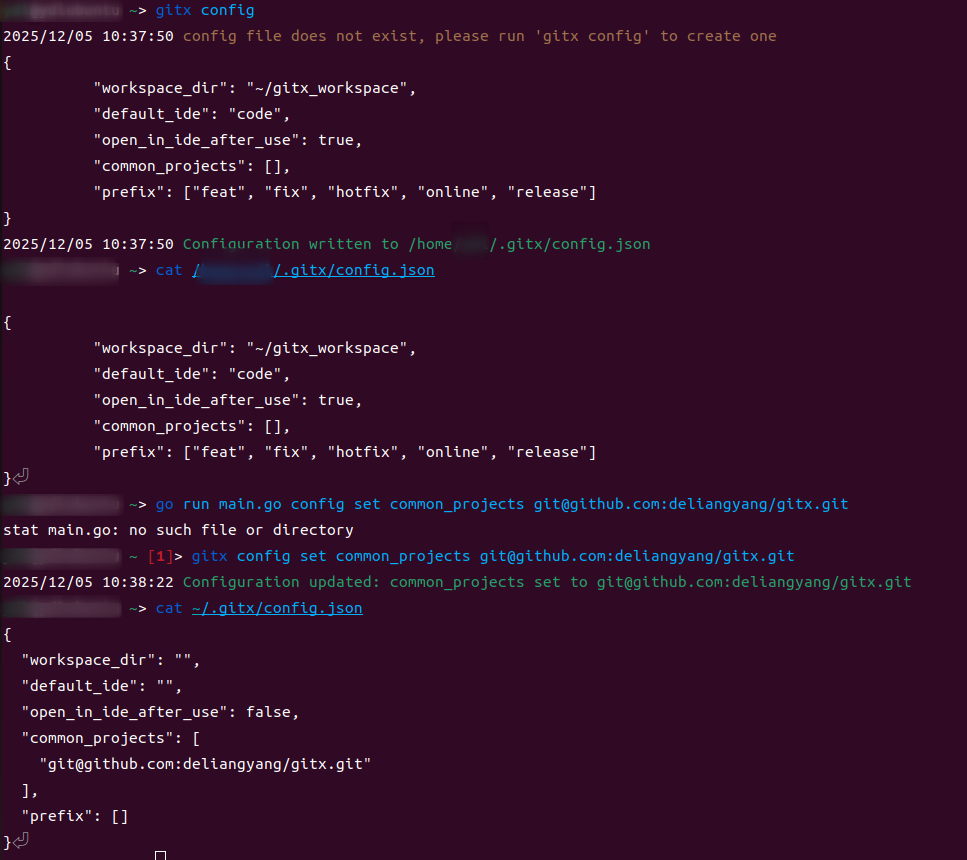

gitx 是使用 go 1.23.5 编写的一个命令行工具，旨在增强 git 的功能，提高项目管理的效率。

## gitx 功能介绍

### 七个项目管理命令
1. clone - 克隆指定的 Git 仓库，并切换到指定的分支。
2. fetch - 快速合并 stable/main（稳定分支）代码。
3. sync - 将特性分支代码合并到开发分支。
4. select - 选择 config 配置的项目进行克隆。
5. rename - 修改版本名称。
6. use - 切换到指定的项目目录。
7. am - 使用 AI 助手生成 git commit 信息。

### 三个辅助命令
1. config - 设置工作目录，管理配置。
2. install - 安装 gitx 工具。
3. doc - 获取文档地址。



## 依赖

1. github.com/spf13/cobra - 用于创建强大的命令行应用程序。
2. github.com/manifoldco/promptui - 用于在命令行中创建交互式提示。
3. github.com/openai/openai-go/v3 - 用于与 OpenAI API 进行交互，提供智能功能，生成 git commit 信息。

## main.go

```go
package main

import (
	"log"

	"github.com/deliangyang/gitx/commands"
	"github.com/spf13/cobra"
)

var (
	version = "v1.0.0"
	rootCmd = &cobra.Command{
		Use:   "gitx",
		Short: "A CLI tool for advanced Git operations",
		Long: `A CLI tool for advanced Git operations.
It provides various commands to manage Git repositories efficiently.`,
	}
)

func main() {
	rootCmd.AddCommand(commands.ConfigCmd)      // 设置工作目录
	rootCmd.AddCommand(commands.CloneCmd)       // 克隆仓库
	rootCmd.AddCommand(commands.SelectCmd)      // 选择 config 配置的项目
	rootCmd.AddCommand(commands.SyncCmd)        // 将特性分支代码合并到开发分支
	rootCmd.AddCommand(commands.FetchCmd)       // 快速合并 stable/main 分支代码
	rootCmd.AddCommand(commands.AICommitCmd)    // 使用 AI 助手生成提交信息
	rootCmd.AddCommand(commands.InstallCmd)     // 安装 gitx
	rootCmd.AddCommand(commands.RenameCmd)      // 修改版本名称
	rootCmd.AddCommand(commands.UseCmd)         // 切换版本
	rootCmd.AddCommand(commands.DocCmd)         // 获取文档地址
	rootCmd.Version = version
	if err := rootCmd.Execute(); err != nil {
		log.Fatalln("Execute rootCmd fail:", err)
	}
}
```

## 待完善

1. 目前只支持 Linux 系统，后续计划支持 Windows 和 MacOS。
2. 根据自己和其他使用者的需求，增加更多 git 操作命令，提升项目管理和工作效率。