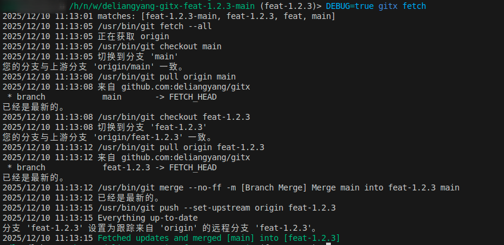

# Gitx 同步主分支代码到开发分支

如果需要将主分支（如 stable 或 main）的代码合并到当前的开发分支，有哪些流程？需要执行哪些命令？

## 通常的做法是
1. 切换到主分支，执行 `git checkout stable` 或 `git checkout main`。
2. 拉取最新的主分支代码，执行 `git pull`。
3. 切换回开发分支，执行 `git checkout <dev-branch>`。
4. 将主分支代码合并到开发分支，执行 `git merge stable` 或 `git merge main`。
5. 推送合并后的代码到远程仓库，执行 `git push`。

这么多步骤操作起来比较繁琐，gitx 提供了更简便的方式来完成这一操作。

gitx 是一个命令行工具，专门用于增强 git 的功能，提高项目管理的效率。其中有一个功能是 fetch，可以帮助用户快速将主分支代码合并到当前的开发分支。

## gitx fetch 命令

其实也没有什么高大上的原理，gitx fetch 命令就是将上述五个步骤简化为一个命令来执行。用户只需要在当前的开发分支目录下运行 `gitx fetch`，gitx 会自动完成切换主分支、拉取最新代码、切换回开发分支、合并主分支代码以及推送代码等操作。

`gitx fetch` 默认同步 main 分支的代码，如果需要同步 stable 分支的代码，可以使用 `-b` 参数指定分支名称，例如 `gitx fetch -b stable`。

## 总结

1. 这种做法可以概括为命令打包，将多个 git 命令封装成一个命令，简化操作流程。
2. 使用 gitx fetch 命令可以大大提高将主分支代码合并到开发分支的效率，减少手动操作的步骤。
3. 这种方法适用于需要频繁同步主分支代码的开发场景，节省时间和精力。
4. 同时也可以避免因手动操作失误导致的错误，提高代码管理的可靠性。