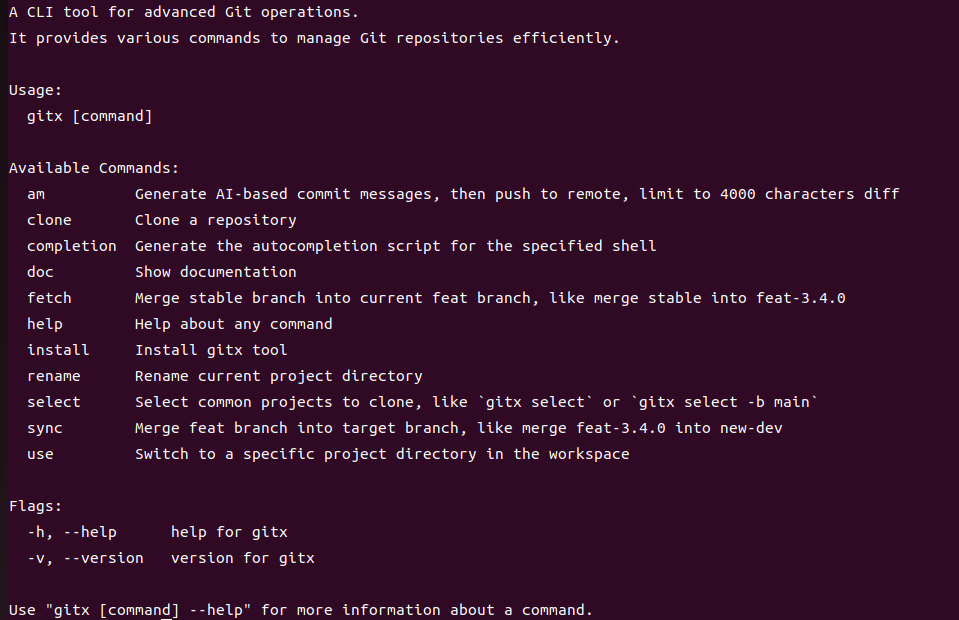
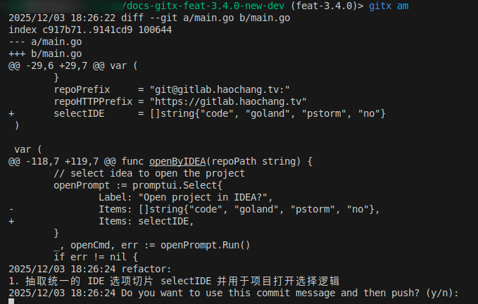

在项目版本迭代开发过程中，可能会出现这种复杂的开发流程，一个项目多个版本并行开发，如果只在一个项目目录下操作，切换分支时可能会出错，影响开发效率。为了解决这个问题，我开发了一个命令行工具，叫做 gitx，来提升 git 多版本并行开发的效率。

我之前是用 shell 脚本实现的，感觉效率挺高的。现在用 go 重写分享出来，喜欢用命令行的可以试试。目前在 Linux 机器上可以正常使用，其他平台需要大家来完善兼容。

## gitx 功能特点 
1. 可以将不同版本的代码放在不同的工作目录中，避免忘记切换分支，在错误的分支开发代码。
2. gitx 还可以通过 AI 助手生成提交信息
3. 快速合并 stable（稳定分支）代码
4. 快速将特性分支的代码合并到开发分支。
5. 修改版本，快速 rename。
6. 使用 use 命令快速切换版本。

### gitx 使用说明



### 安装

```bash
go install github.com/deliangyang/gitx@latest
```

### 设置工作目录

设置环境变量 `WORKSPACE_DIR`，指定工作目录，默认为 `~/work`。

```bash
export WORKSPACE_DIR=~/my_workspace
```

## 命令介绍

### am 命令

使用 AI 助手生成提交信息，并将更改推送到远程仓库。
确保已设置 `OPENAI_API_KEY` 环境变量。

```bash
gitx am   # 交互式确认提交

OPENAI_API_KEY="your_openai_api_key" gitx am    # 交互式确认提交

OPENAI_API_KEY="your_openai_api_key" gitx am -y # 自动确认提交
```



### clone 命令
克隆指定的 Git 仓库，并切换到指定的分支。支持使用 IDE 打开项目目录，例如 VSCode、Goland、PHPStorm。

```bash
gitx clone <repository_url> <version> <branch> [-b <base_branch>]
```
例如：

```bash
gitx clone git@github.com:deliangyang/gitx.git feat-3.4.0 new-dev              # 默认分支 stable
gitx clone git@github.com:deliangyang/gitx.git feat-3.4.0 new-dev -b main      # 指定源分支 main
``` 

### sync 命令
基于当前目录的特征 (hello-world-feat-3.4.0-new-dev)，将指定的 feat 分支合并到目标分支。

```bash
gitx sync
```
例如，将 feat-3.4.0 分支合并到 new-dev 分支。

### fetch 命令

基于当前目录的特征 (hello-world-feat-3.4.0-new-dev)，将稳定分支合并到当前的 feat 分支。

```bash
gitx fetch                      # 默认分支 stable

gitx fetch -b main              # 指定源分支 main
```

### select 命令
选择常用项目进行克隆。

```bash
gitx select                     # 使用默认分支 stable
gitx select -b main             # 指定源分支 main
```

### rename 命令

重命名当前项目目录，重置新的版本号。

```bash
pwd
# hello-world-feat-1.2.0-new-dev
gitx rename feat-1.3.0    # 当前版本为 feat-1.2.0，则重命名为 feat-1.3.0

pwd
# hello-world-feat-1.3.0-new-dev
```

### use 命令

切换到工作区中的特定项目目录。

```bash
gitx use
```


### install 命令
更新 gitx 工具到最新版本：

```bash
gitx install
```

### doc 命令

显示文档链接：[https://github.com/deliangyang/gitx/-/tree/main?ref_type=heads#%E5%8A%9F%E8%83%BD](https://github.com/deliangyang/gitx/-/tree/main?ref_type=heads#%E5%8A%9F%E8%83%BD)

### 版本
查看当前工具的版本：

```bash
gitx --version
```