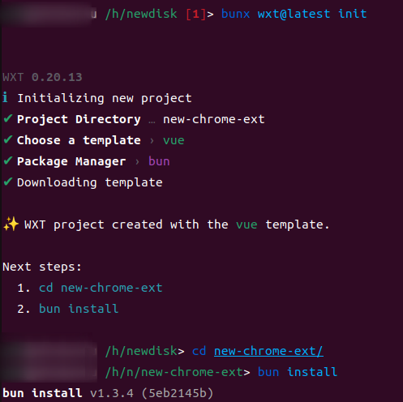
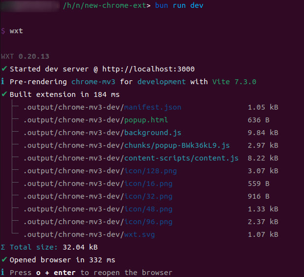
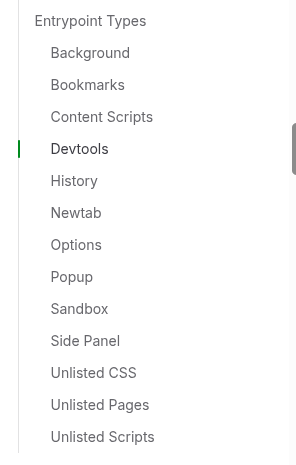

# Chrome 插件开发 WXT 框架入门

## 使用脚手架生成项目框架

WXT 是一套成熟的浏览器插件开发框架，简单的几条命令就可以生成框架的基础代码，快速运行和完成调试。

```bash
bunx wxt@latest init
```



## 运行项目

开发调试过程中，只需要通过执行 `bun run dev` 即可实时查看改动的结果。执行 `bun run build` 编译项目，生成到目录 `.output/chrome-mv3` 下，然后就可以通过 Chrome 插件管理导入该插件了。



## 项目目录结构及意义

```text
📂 {rootDir}/
   📁 .output/
   📁 .wxt/
   📁 assets/
   📁 components/
   📁 composables/
   📁 entrypoints/
   📁 hooks/
   📁 modules/
   📁 public/
   📁 utils/
   📄 .env
   📄 .env.publish
   📄 app.config.ts
   📄 package.json
   📄 tsconfig.json
   📄 web-ext.config.ts
   📄 wxt.config.ts
```

- .output/所有构建产物都将放在这里。
- .wxt/由 WXT 生成，包含 TS 配置
- assets/包含所有需要由 WXT 处理的 CSS、图像和其他资源
- components/默认自动导入，包含 UI 组件
- composables/默认自动导入，包含项目中 Vue 可组合函数的源代码。
- entrypoints/包含所有将捆绑到扩展程序中的入口点
- hooks/默认自动导入，包含项目中 React 和 Solid 钩子的源代码。
- modules/包含项目所需的本地 WXT 模块
- public/：包含您希望原样复制到输出文件夹中的任何文件，无需经过 WXT 处理。
- utils/默认自动导入，包含项目中常用的通用实用程序
- .env 包含环境变量
- .env.publish 包含用于发布的环境变量
- app.config.ts 包含运行时配置
- package.json：您的软件包管理器使用的标准文件
- tsconfig.json：告诉 TypeScript 如何运行的配置
- web-ext.config.ts 配置浏览器启动
- wxt.config.ts：WXT 项目的主配置文件

## 程序入口 entrypoints

以 Chrome 为例，有如下入口类型



WXT 框架设计很有意思，每一个入口都有一个对应的目录结构，popup 是一个页面，所以它存在 HTML，CSS 和 js/ts 文件，background 是纯 js 逻辑，所以里面放置的都是 ts/js 文件
```
📂 entrypoints/
   📂 popup/
      📄 index.html     ← This file is the entrypoint
      📄 main.ts
      📄 style.css
   📂 background/
      📄 index.ts       ← This file is the entrypoint
      📄 alarms.ts
      📄 messaging.ts
   📂 youtube.content/
      📄 index.ts       ← This file is the entrypoint
      📄 style.css
```

## 如何配置 manifest

项目根目录有一个文件 `wxt.config.ts`，里面可以配置 manifest。ts 有一个好处，manifest 有哪些字段都会通过 Volar 提示出来，写起来十分舒服。这里就不过多介绍了，其实和原生的配置 `manifest.json` 没有什么区别，有一个好处是 WXT 会自动帮你配置一下 manifest。

```ts
import { defineConfig } from 'wxt';

// See https://wxt.dev/api/config.html
export default defineConfig({
  modules: ['@wxt-dev/module-vue'],
  manifest: {
    permissions: ['storage', 'network'],
  }
});
```

完成配置之后就可以进入简单的开发了。后面再详细的介绍如何使用 WXT 来开发项目，或者使用 WXT 重写之前的插件。

## Chrome 插件开发历史