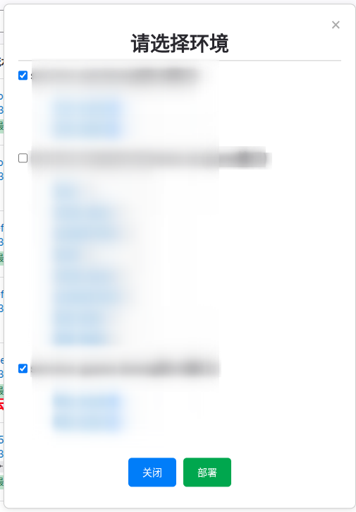

Chrome 插件开发实现弹出层是通过 js 动态生成 DOM 结构，在 HTML 元素中动态插入其它的节点，然后通过 CSS 控制显示和隐藏，或者通过 JavaScript 控制节点的添加和移除。

下面是一个简单的示例，展示如何在 Chrome 插件中实现一个弹出层。

## 配置权限
在 `manifest.json` 文件中增加如下配置即可。这里不需要额外的权限配置，只需要确保有 `activeTab` 权限以便操作当前页面。

```json
{
    ...
    "permissions": [
        ...
        "activeTab"
    ],
    "background": {
        "service_worker": "background.js"
    },
    "action": {
        "default_popup": "popup.html"
    }
}
```

## popup.html 示例

```html
<!DOCTYPE html>
<html lang="en"></html>
<head>
    <meta charset="UTF-8" />
    <meta name="viewport" content="width=device-width, initial-scale=1.0" />
    <title>弹出层示例</title>
</head>
<body>
</body>
</html>
```

## background.js 示例

```js

const createCloseButton = () => {
    // top right close button
    const closeButton = document.createElement('span');
    closeButton.innerHTML = '&times;';
    closeButton.style.position = 'absolute';
    closeButton.style.top = '10px';
    closeButton.style.right = '20px';
    closeButton.style.cursor = 'pointer';
    closeButton.style.fontSize = '24px';
    closeButton.style.color = '#aaa';
    closeButton.onclick = () => {
        document.body.removeChild(popup);
    };
    return closeButton;
}

const createPopup = (message) => {
    const popup = document.createElement('div');
    popup.style.position = 'fixed';
    popup.style.top = '50%';
    popup.style.width = '500px';
    popup.style.padding = '20px';
    popup.style.minHeight = '100px';
    popup.style.maxHeight = '80vh';
    popup.style.overflowY = 'auto';
    popup.style.left = '50%';
    popup.style.transform = 'translate(-50%, -50%)';
    popup.style.backgroundColor = '#fff';
    popup.style.border = '1px solid #ccc';
    popup.style.borderRadius = '8px';
    popup.style.overflowY = 'auto';
    popup.style.fontSize = '16px';
    popup.style.padding = '20px';
    popup.style.boxShadow = '0 2px 10px rgba(0, 0, 0, 0.1)';
    popup.style.zIndex = '10000';
    popup.innerHTML = message;
    popup.appendChild(createCloseButton());

    document.body.appendChild(popup);
}

chrome.action.onClicked.addListener((tab) => {
    chrome.scripting.executeScript({
        target: { tabId: tab.id },
        function: createPopup,
        args: ['这是一个弹出层示例！点击右上角的 × 关闭。']
    });
});
```

## 案例展示

如下就是我使用弹出层在 gitlab 做的一个手动将镜像部署到其它平台的插件。



## 总结

样式是通过元素的 style 属性动态设置的，内容是通过 innerHTML 动态插入的。在 Chrome 插件开发中，使用 js 来动态生成 DOM 结构是非常常见的做法。