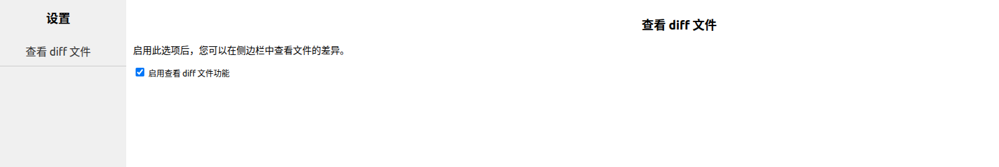
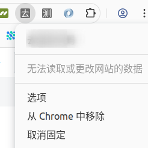

# Chrome 插件 Options Page：实现设置页

用户在使用软件时，使用习惯各有不同。如果能够提供一个让用户自由设置的功能，能使软件的体验更加友好。

Chrome 插件开发不需要太担心这个问题，官方提供了相关实现及文档。根据官方文档，我们可以配置一个插件的 “Options”，[文档地址 Options Page](https://developer.chrome.com/docs/extensions/develop/ui/options-page?hl=zh-cn)。

“查看 commit 的文件列表”这个功能需要支持自由配置：是否启用。对这个功能有需求的用户就可以开启，否则就可以关闭；强制弹出等于硬塞给用户，体验很不友好。这个时候需要一个开关来控制是否启用这个功能。

设置要么跟用户走，要么跟设备走；下次打开页面，上次的状态需要能够被恢复。需要永久存储我们的配置（在不被删除的情况下），有两种解决方案：
> 1. 自己实现两个接口，一个保存配置，另一个是获取配置。  
> 2. 使用 Chrome 的 API `chrome.storage.sync`，调用 set/get 方法设置、获取我们的配置。

## manifest.json 配置 Options

官方提供两种配置方案，第一种是打开一个新的页面。

```json
{
  "name": "My extension",
  ...
  "options_page": "options.html",
  ...
}
```

第二种是嵌入式，在当前页面以弹窗的形式展示设置页。

```json
{
  "name": "My extension",
  ...
  "options_ui": {
    "page": "options.html",
    "open_in_tab": false
  },
  ...
}
```

## 实现 Options.html

Options.html 没有什么规范，和平时的页面编写没什么区别。

```html
<!DOCTYPE html>
<html>
  <head>
    <meta charset="UTF-8" />
    <meta name="viewport" content="width=device-width, initial-scale=1.0" />
    <title>Options</title>
  </head>

  <style>
    html,body {margin:0;padding:0;height:100%;}
    .container {display:flex;height:100vh;}
    .left-container {flex:1;background-color:#f0f0f0;}
    .right-container {flex:8;background-color:#ffffff;padding:10px;}
    h2 {text-align:center;}
    ul {list-style-type:none;padding:0;text-align:center;}
    li {padding:10px;border-bottom:1px solid #ccc;font-size:16px;}
    a {text-decoration:none;color:#333;}
    a:hover {text-decoration:underline;}
    .panel {display:none;}
    .panel.active {display:block;}
    label {cursor:pointer;}
    .panel p {font-size:14px;}
  </style>
  <body>
    <div class="container">
        <div class="left-container">
            <h2>设置</h2>
            <ul>
                <li><a href="#show-diff-file" id="show-diff-file">查看 diff 文件</a></li>
            </ul>
        </div>
        <div class="right-container">
            <div class="panel active" data-id="show-diff-file">
                <h2>查看 diff 文件</h2>
                <p>启用此选项后，您可以在侧边栏中查看文件的差异。</p>
                <label>
                    <input type="checkbox" id="enable-diff-file">
                    启用查看 diff 文件功能
                </label>
            </div>
        </div>
    </div>

    <script src="options.js"></script>
  </body>
</html>
```




### 实现 options.js 存储和获取配置

为了快速实现这个简单的需求，这里使用 Chrome 的 API 来存储配置。但在使用 API 前，需要在清单里声明存储权限 `storage`。

```json
{
  "name": "My extension",
  ...
  "permissions": [
    "storage"
  ]
  ...
}
```

options.js 没有什么特殊规范：实现两个方法（保存配置、恢复配置）；在 `DOMContentLoaded` 时加载配置，并为 checkbox 添加点击事件以保存配置。

```js
// Saves options to chrome.storage
const saveOptions = () => {
  const enableShowDiffFile = document.getElementById('enable-diff-file').checked;

  chrome.storage.sync.set(
    { enableShowDiffFile: enableShowDiffFile },
    () => {
        console.log('Options saved.');
    }
  );
};

// stored in chrome.storage.
const restoreOptions = () => {
  chrome.storage.sync.get(
    { enableShowDiffFile: true },
    (items) => {
      document.getElementById('enable-diff-file').checked = items.enableShowDiffFile;
    }
  );
};

document.addEventListener('DOMContentLoaded', restoreOptions);
document.getElementById('enable-diff-file').addEventListener('click', saveOptions);
```

### 在入口处使用配置，控制查看 commit 的文件列表

通过 `chrome.storage.sync.get` 获取 `enableShowDiffFile` 的值，如果为 true，则执行 commit 文件列表展示的功能，否则不显示。默认开启这个功能。

```js
if (isGitlab) {
    chrome.storage.sync.get(
        { enableShowDiffFile: true },
        (items) => {
            if (!items.enableShowDiffFile) {
                return;
            }
            let timerFindCommitTimer = setTimeout(() => {
                findCommitFiles();
                timerFindCommitTimer = null;
            }, 1000);
        }
    );
}
```




## 总结

1. 首先拿到这个需求时，并不知道该如何下手，通过搜索一番找到了解决方案，如果我熟读或者浏览过官方文档，便没有了之前的焦虑
2. 这个插件功能的实现比较流畅，借助官方的 demo，使得我很快上手，实现一个小的需求