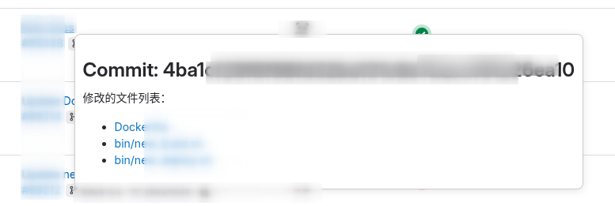

# Chrome 插件快速查看 Commit 文件列表

## 背景

不管是 github，还是 gitlab，查看某个 commit 的文件列表，并跳转到对应的文件，操作比较繁琐。为了达到这个查看目的至少需要跳转 2 个页面，点击 2 次才能看到文件内容。

1. 点击 commit 信息的 URL，进入 commit 详情页面
2. 滚动鼠标滚轮，找到列表中需要查看的文件，移动到页面右侧，点击“浏览文件”
3. 跳转到文件内容页面，等待页面加载完成，查看文件内容

如果有一个功能，鼠标悬停在 commit 的 hash 上，就能看到文件列表，点击文件名就能跳转到对应的文件内容页面，那该多好啊！

## 实现思路

想了一下，可以通过开发一个浏览器插件实现我们的需求，主要分为以下几个步骤：

### 1. 获取页面中的所有链接，并过滤出 commit 的链接
```js
let allLink = document.querySelectorAll('a');
let filterCommitLinks = [];
allLink.forEach(link => {
    const href = link.getAttribute('href');
    if (href && /\/commit\//.test(href)) {
        filterCommitLinks.push(link);
    }
});
```

### 2. 监听鼠标悬停事件，获取 commit 的文件列表
```js
link.addEventListener('mouseover', () => {
    for (const popup of allLinkPopups) {
        if (popup && popup.parentElement) {
            popup.parentElement.removeChild(popup);
        }
    }
    allLinkPopups = [];

    const commitHashMatch = href.match(/\/commit\/([a-f0-9]{7,40})/);
    if (!commitHashMatch || commitHashMatch.length < 2) {
        return;
    }
    const commitHash = commitHashMatch[1];
    fetchWithCookies({ url: `${href}/diff_files` })
        .then(response => {
            // 解析返回的 HTML，提取文件列表
        }).catch(error => {
            console.error('Error fetching commit files:', error);
        });
});
```
### 3. 创建弹窗并显示文件列表
```js
const createCommitFilesPopup = (href, commitHash, matches) => {
    let message = `<h3>Commit: ${commitHash}</h3><p>修改的文件列表：</p><ul>`;
    for (const match of matches) {
        let new_url = href.replace(/(\/-\/commit\/[a-f0-9]{7,40})/, `/-/blob/${commitHash}`) + `/${match[1]}`;
        message += `<li>
        <a href="${new_url}" target="_blank">${match[1]}</a>
        </li>`;
    }
    message += '</ul>';
    const popup = document.createElement('div');
    popup.style.position = 'absolute';
    popup.style.backgroundColor = '#fff';
    popup.style.border = '1px solid #ccc';
    popup.style.padding = '10px';
    popup.style.boxShadow = '0 2px 10px rgba(0, 0, 0, 0.1)';
    popup.style.zIndex = '1000';
    popup.style.borderRadius = '8px';
    popup.innerHTML = message;
    return popup
}
```

### 4. 解析返回的 HTML 并显示弹窗，鼠标离开时关闭弹窗
```js
fetchWithCookies({ url: `${href}/diff_files` })
    .then(response => {
        const matches = response.matchAll(/data-title="([^"]+)"/g);
        if (matches) {
            const popup = createCommitFilesPopup(href, commitHash, Array.from(matches));
            document.body.appendChild(popup);
            allLinkPopups.push(popup);

            const rect = link.getBoundingClientRect();
            popup.style.top = `${rect.bottom + window.scrollY}px`;
            popup.style.left = `${rect.left + 66 + window.scrollX}px`;

            popup.addEventListener('mouseleave', () => {
                document.body.removeChild(popup);
                for (const popup of allLinkPopups) {
                    if (popup && popup.parentElement) {
                        popup.parentElement.removeChild(popup);
                    }
                }
                allLinkPopups = [];
            }, { once: true });
        }
    })
    .catch(error => {
        console.error('Error fetching commit data:', error);
    });
```

### 5. 处理动态加载的页面

将代码实现封装成一个函数 `findCommitFiles`，然后使用定时器检测页面中是否有 commit 链接，如果有则执行该函数。

```js
if (isGitlab) {
    let timerFindCommitTimer = setTimeout(() => {
        findCommitFiles();
        timerFindCommitTimer = null;
    }, 1000);
}
```

## 查看效果

悬停在 commit hash 上，显示文件列表：



## 总结

1. 该功能可以大大提高查看 commit 文件列表的效率，减少不必要的页面跳转。
2. 目前只实现了 GitLab 的支持，后续可以考虑添加对 GitHub 等其他代码托管平台的支持。