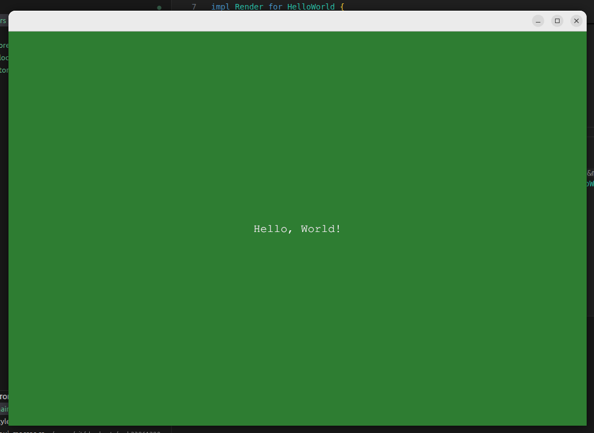
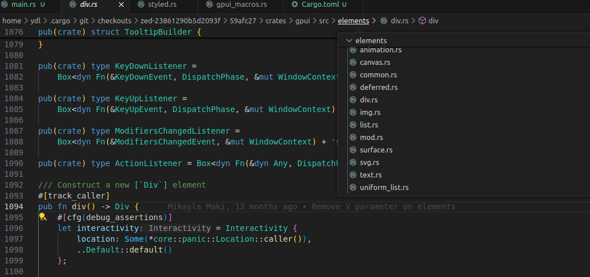
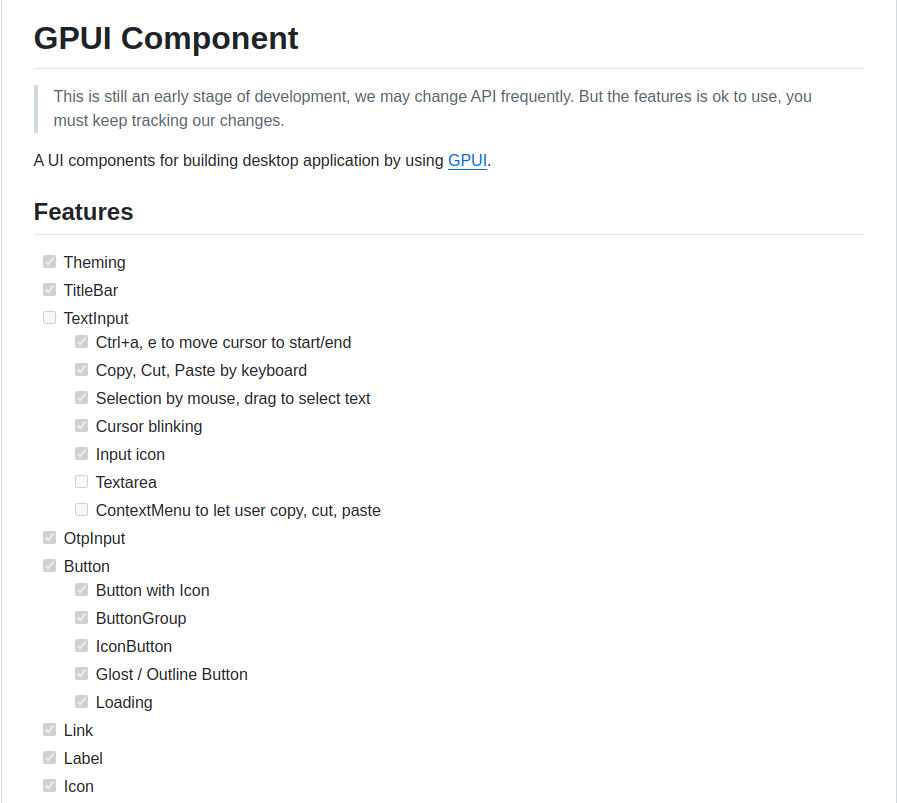

Zed 是下一代代码编辑器，专为人类和人工智能的高性能协作而设计。他们在实现 Zed 的过程中给自己开发了一套 UI 框架 `gpui`。其官方地址为 [www.gpui.rs](https://www.gpui.rs/)。

> A fast, productive UI framework for Rust from the creators of Zed.

官方的介绍特别有趣，“今天，它是 Zed 的 UI 框架，明天，是你的！”，“我们希望您能帮助我们实现这一目标。”。是不是很有意思，很大诚意的邀请你使用它，开发它，让它创造更大的价值，这就是开源精神。从来不怕你抄袭，只希望你能一起完善它等等。

> Today, it's Zed's UI framework. Tomorrow, it's yours!  
> We'd love your help making that happen.


| 相关知识 | 说明 |
|:----|:----|
|gpui – README|	Intro to gpui (gpui's README)|
|gpui – gpui.rs|Core functionality and API of gpui (gpui's crate root)|
|Contexts|	Explanation of different contexts in gpui|
|Key Dispatch|	Details on key event dispatching in gpui|

| 案例 | 说明 |
|:----|:----|
|Hello World|	The basic "Hello, World!" example|
|Animation	 | Rotating SVG animation |
|GIF Viewer |	GIF image in a window |
|Image	 |Loading and displaying images |
|Input	 |Basic text input field |
|Opacity |	Changing opacity with animations |
|Set Menus |	Application menus creation and usage |
|Shadow |	Element with shadow |
|SVG	 |SVG images with different colors |
|Text Wrapper |	Text wrapping techniques |
|Uniform List |	Optimized scrollable list using uniform heights |
|Window Positioning |	Window positioning techniques |
|Window Shadow |	Custom window shadows and resizing |
|Window	Window | types and operations  |

### 尝试使用 gpui 写一个 hello world 的桌面程序

官方还没有提供 gpui 相关的文档，可以在代码仓库里看到一些案例。如果你想学习或者将这套 UI 框架应用到自己的桌面程序中的话，需要自己消化这些代码，提取相关的信息。

接下来我们来实现一个简单的入门程序。通过如下命令创建一个项目 `gpui-test-rs`。

```
cargo new gpui-test-rs
```

编辑 Cargo.toml，引入依赖 gpui 库。

```toml
[package]
name = "gpui-test-rs"
version = "0.1.0"
edition = "2021"

[dependencies]
gpui = { git = "https://github.com/zed-industries/zed" }
```

将官方提供的 Hello Word 源码直接覆盖 main.rs。

```rust
use gpui::*;
 
struct HelloWorld {
    text: SharedString,
}
 
impl Render for HelloWorld {
    fn render(&mut self, _cx: &mut ViewContext<Self>) -> impl IntoElement {
        div()
            .flex()
            .bg(rgb(0x2e7d32))
            .size_full()
            .justify_center()
            .items_center()
            .text_xl()
            .text_color(rgb(0xffffff))
            .child(format!("Hello, {}!", &self.text))
    }
}
 
fn main() {
    App::new().run(|cx: &mut AppContext| {
        cx.open_window(WindowOptions::default(), |cx| {
            cx.new_view(|_cx| HelloWorld {
                text: "World".into(),
            })
        })
        .unwrap();
    });
}
```

执行 `cargo run` 就可以看到生成的 Hello World 桌面程序了。



### 一些猜测

官方对这套 UI 框架提供了少量的文档，大部分的入门信息需要通过看代码，加上一些代码设计的猜测来提取。AppContext 是应用上下文，用来实现各个元素之间的消息传递，open_window 打开一个窗口，ctx.new_view 创建一个视图，HelloWorld 是我们自己实现的一个元素（基于 div 元素）。再看看 HelloWord 的 render 方法，如果你知道点 HTML + CSS 就会发现，div 是一个 HTML 的标签，后面一系列的链式方法就是 CSS 样式。child 方法表示这个 div 元素内嵌套的子元素，可以是 div，文本，图片等等。gpui 样式的设计应该借鉴了 `tailwindcss`，怪不得有点熟悉的味道。

```rust
/// crates/gpui/src/styled.rs
/// A trait for elements that can be styled.
/// Use this to opt-in to a utility CSS-like styling API.
pub trait Styled: Sized {
    /// Returns a reference to the style memory of this element.
    fn style(&mut self) -> &mut StyleRefinement;

    ...

    /// Sets the display type of the element to `block`.
    /// [Docs](https://tailwindcss.com/docs/display)
    fn block(mut self) -> Self {
        self.style().display = Some(Display::Block);
        self
    }
    ...
}
```

gpui 的元素并没有包含所有的 HTML 标签，包含了一些常用的元素，比如：动画，列表，块级元素，画板，图片，SVG 等等。有了这些基础的元素，我们可以在这个基础之上设计自己需要的元素。



### 扩展知识，gpui-component 组件库

[gpui-component](https://github.com/longbridge/gpui-component) 是基于 gpui 实现的一个组件库，是长桥（longbridge）主导的组件库，应用于股票交易的桌面应用，目前大部分的组件已经开发完成。如下图片展示了部分组件的完成进度，详细信息可以跳转到相关 github 仓库了解。



看一下 gpui-component 对 Button 结构体的定义和实现，Button 提供了 `IntoElement` 的实现（#[derive(IntoElement)]），符合视图渲染的接口要求。一个 button 包含了样式展示和事件的处理，样式可以通过 Styled 定制自己的需求，点击事件需要通过绑定 Listener 来监听事件，事件处理是一个异步回调的处理过程。

```rust
/// A Button element.
#[derive(IntoElement)]
pub struct Button {
    pub base: Div,
    id: ElementId,
    icon: Option<Icon>,
    label: Option<SharedString>,
    children: Vec<AnyElement>,
    disabled: bool,
    pub(crate) selected: bool,
    variant: ButtonVariant,
    rounded: ButtonRounded,
    border_corners: Corners<bool>,
    border_edges: Edges<bool>,
    size: Size,
    compact: bool,
    tooltip: Option<SharedString>,
    on_click: Option<Box<dyn Fn(&ClickEvent, &mut WindowContext) + 'static>>,
    pub(crate) stop_propagation: bool,
    loading: bool,
    loading_icon: Option<Icon>,
}
```

体验过用 Zed 开发后，不得不惊叹其渲染。如果后面需要开发桌面应用程序，优先可以考虑一下这套 UI 框。