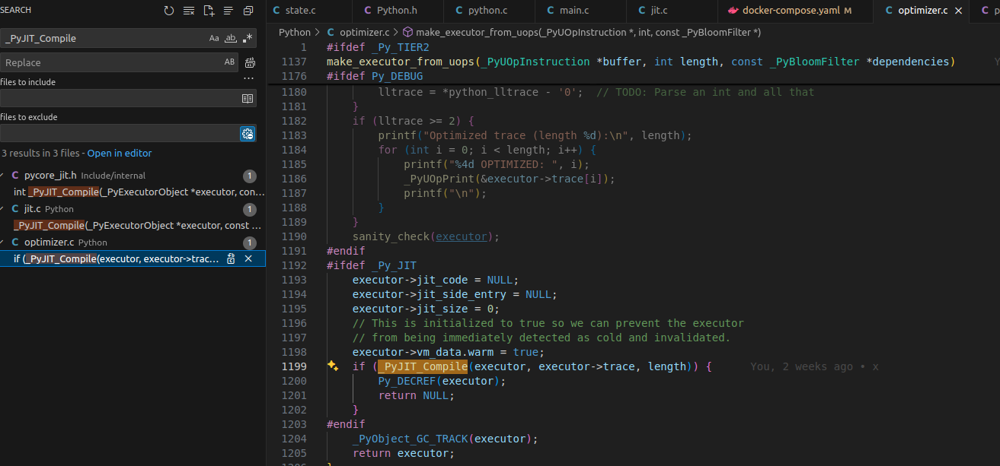
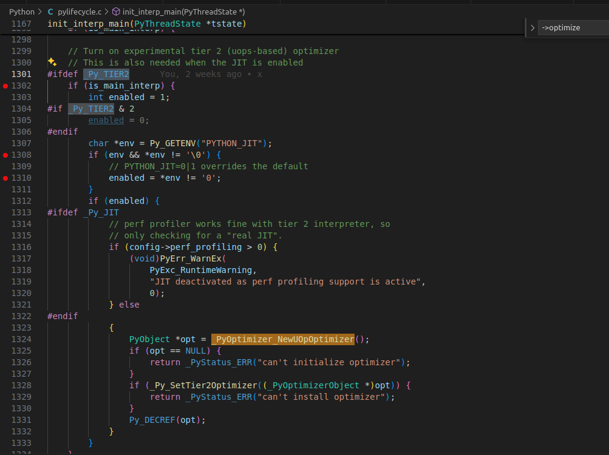

前面介绍那么多只是为了做一些铺垫，每个操作码对应一个 emit 函数。什么时候调用这些函数就是我们接下来需要研究的。

### 回顾

- [如何在 Ubuntu2404 上编译 PythonJIT](https://mp.weixin.qq.com/s/vReIpLQXLMlA8Pvi2dps0A)
- [PythonJIT 中的机器代码是如何生成的](https://mp.weixin.qq.com/s/isYS5PxtRjjjW97ET122LQ)
- [PythonJIT-copy-and-patch 的处理的详细过程](https://mp.weixin.qq.com/s/DMvtti3U9HYwXMtlFVp2FQ)
- [PythonJIT 反向推断 patch 的生成过程](https://mp.weixin.qq.com/s/DMaZYgnBlVfzWxSj2kDAlQ)


> // Compile the shim, which handles converting between the native  
> // calling convention and the calling convention used by jitted code  
> // (which may be different for efficiency reasons).  


### JIT 代码转换时机


在项目代码内搜索 stencil_groups 可以看到它在函数 `_PyJIT_Compile` 被索引，index 为操作码。往下继续看代码，stencil_groups 在两个循环里被索引。第一个循环设置代码块的开始 `state.instruction_starts[i] = code_size` 位置；而第二个循环是调用 OpCode 对应的 emit 函数，将调用转化为我们的 jit 代码。完成内存转换后，将这块内存标记为可执行，调用 c 函数 `mprotect`，标记失败返回 -1，释放内存。

```c
static int
mark_executable(unsigned char *memory, size_t size)
{
    if (size == 0) {
        return 0;
    }
    assert(size % get_page_size() == 0);
    // Do NOT ever leave the memory writable! Also, don't forget to flush the
    // i-cache (I cannot begin to tell you how horrible that is to debug):
#ifdef MS_WINDOWS
    if (!FlushInstructionCache(GetCurrentProcess(), memory, size)) {
        jit_error("unable to flush instruction cache");
        return -1;
    }
    int old;
    int failed = !VirtualProtect(memory, size, PAGE_EXECUTE_READ, &old);
#else
    int failed = 0;
    __builtin___clear_cache((char *)memory, (char *)memory + size);
#ifndef MAP_JIT
    failed = mprotect(memory, size, PROT_EXEC | PROT_READ);
#endif
#endif
    if (failed) {
        jit_error("unable to protect executable memory");
        return -1;
    }
    return 0;
}
```

### 用 uops 缓冲区创建执行器



JIT 是 PythonJIT 的核心，通过 JIT 生成的代码，我们可以看到它是通过 uops 缓冲区来执行的。这个缓冲区是一个很小的内存区域，用来存储 CPU 的微指令。在 JIT 代码生成后，我们需要将这些代码放入 uops 缓冲区，然后执行。
可以理解为一个如下函数，传入 JIT 生成的代码，然后执行。

```c
static void
execute_jit_code(unsigned char *memory, size_t size)
{
    void (*fn)(void) = (void (*)(void))memory;
    fn();
}
```

### 何时开启 JIT 优化



是否开启 jit 有一部分有预处理定义控制（即 _Py_JIT 定义开启），另一部分就是 `config->perf_profiling == 0`，否则会抛出异常。_PyOptimizer_NewUOpOptimizer 将 uop_optimize 函数赋值给了 opt->optimize，这个函数是在 `Python/optimizer.c` 中定义的。JIT 的核心优化逻辑就在 uop_optimize 函数中。

```c
PyObject *
_PyOptimizer_NewUOpOptimizer(void)
{
    _PyOptimizerObject *opt = PyObject_New(_PyOptimizerObject, &_PyUOpOptimizer_Type);
    if (opt == NULL) {
        return NULL;
    }
    opt->optimize = uop_optimize;
    return (PyObject *)opt;
}
```

比如，translate_bytecode_to_trace 返回的长度为 0；环境变量 PYTHON_UOPS_OPTIMIZE 设置为 0 等都不会开启 JIT 优化。uop_optimize 完成 _PyExecutorObject **exec_ptr 的替换，其函数的定义如下：

```c
static int
uop_optimize(
    _PyOptimizerObject *self,
    _PyInterpreterFrame *frame,
    _Py_CODEUNIT *instr,
    _PyExecutorObject **exec_ptr,
    int curr_stackentries,
    bool progress_needed)
{
    ...
}
```

JIT 优化算法的核心逻辑可以在 uop_optimize 函数中找到，其最终的目的就是决定是否使用 JIT 优化。