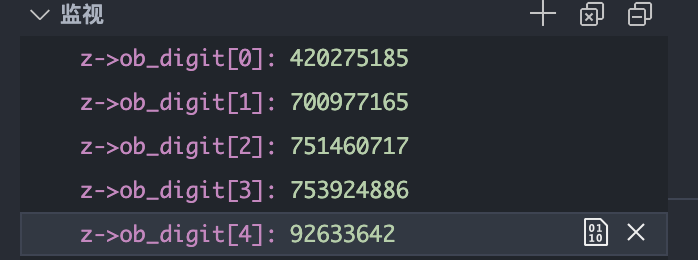
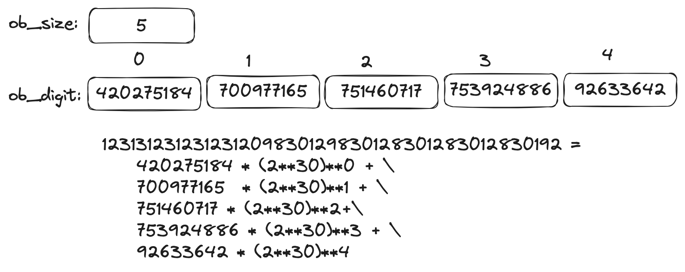

Python源码Objects目录下实现了所有对象的数据类型，包括int、float、str、list、dict、tuple、set等等。

## PyLongObject 结构定义

int的相关实现在`Objects/longobject.c`文件中。对应的结构体是`PyLongObject`，其定义如下：

```c
typedef struct _longobject PyLongObject; /* Revealed in longintrepr.h */

typedef uint32_t digit; // 无符号32位整数

struct _longobject {
    PyObject_VAR_HEAD
    digit ob_digit[1];
};
```

`PyObject_VAR_HEAD`就是`PyVarObject ob_base;`的预处理定义，可以看一下这篇文章[Python内核源码解析：底层基础数据结构PyObject](https://mp.weixin.qq.com/s/kq904XDs_ywYoSB78ReBCg)。ob_digit是一个数组，数组的长度是1，这个数组就是存储int的值。digit是一个无符号32位整数，也就是说，一个int的值，可以用32位的无符号整数数组来表示。

## 为什么用一个数组来存储int的值

到这里就产生了一个疑问，这里为什么要用一个数组来表示呢？因为Python的int是可以无限大的，如果用一个32位的无符号整数来表示，那么最大值就是2^32-1，也就是4294967295，如果要表示更大的值，就需要用到数组了。字节码没什么差异

```python
>>> a = 123131231231231209830129830128301283012830192
>>> print(a)
123131231231231209830129830128301283012830192
>>> type(a)
<class 'int'>
>>> a+1
123131231231231209830129830128301283012830193
```

从字节码来看并没有什么区别，那Python是怎么把这个大的一个值存储到数组中的呢？

```bash
# test.py
a = 123131231231231209830129830128301283012830192
a + 1

python -m dis test.py 
  1           0 LOAD_CONST               0 (123131231231231209830129830128301283012830192)
              2 STORE_NAME               0 (a)

  2           4 LOAD_NAME                0 (a)
              6 LOAD_CONST               1 (1)
              8 BINARY_ADD
             10 POP_TOP
             12 LOAD_CONST               2 (None)
             14 RETURN_VALUE
```

## int的初始化

`_PyLong_New`初始化一个int对象，参数是数组ob_digit的长度，也是ob_size的大小。

`_PyObject_InitVar`初始化一个对象，参数是对象的地址、对象的类型、对象的大小。相关代码如下：

```c
PyLongObject * _PyLong_New(Py_ssize_t size) {
    ...
    // 初始化
    _PyObject_InitVar((PyVarObject*)result, &PyLong_Type, size);
    //  Py_SET_SIZE(op, size);
    //      ob->ob_size = size;
}
```

## int的加法运算

两个int相加会调用`x_add`函数，参数是加号左边的值和右边的值，相关代码如下。

z是两个数值的和，通过`_PyLong_New`初始化一个int对象，这里确保size_a是两个值的最大值，即max(size_a, size_b)，然后z的大小为size_a + 1，这么做是为了防止结果溢出。

计算规则在两个for循环中，先计算两个int的公共部分，然后再计算剩下的部分。最后返回的时候会调用`long_normalize`函数，这个函数会把z的大小调整为实际需要的大小，也就是去掉前面的0，最多可以省去一个字节。

```c
/* Add the absolute values of two integers. */

static PyLongObject *
x_add(PyLongObject *a, PyLongObject *b)
{
    Py_ssize_t size_a = Py_ABS(Py_SIZE(a)), size_b = Py_ABS(Py_SIZE(b));
    PyLongObject *z;
    Py_ssize_t i;
    digit carry = 0;

    /* Ensure a is the larger of the two: */
    if (size_a < size_b) {
        { PyLongObject *temp = a; a = b; b = temp; }
        { Py_ssize_t size_temp = size_a;
            size_a = size_b;
            size_b = size_temp; }
    }
    z = _PyLong_New(size_a+1);
    if (z == NULL)
        return NULL;
    for (i = 0; i < size_b; ++i) {
        carry += a->ob_digit[i] + b->ob_digit[i];
        z->ob_digit[i] = carry & PyLong_MASK;
        carry >>= PyLong_SHIFT;
    }
    for (; i < size_a; ++i) {
        carry += a->ob_digit[i];
        z->ob_digit[i] = carry & PyLong_MASK;
        carry >>= PyLong_SHIFT;
    }
    z->ob_digit[i] = carry;
    return long_normalize(z);
}
```

## int的数据结构

ob_digit每个元素是存储在无符号的32位整数上，但是`PyLong_SHIFT == 30`，意味着存储只用到了30位，这是为什么呢？翻阅代码可以看到如下注释。long_pow()函数要求PyLong_SHIFT必须是5的倍数，30是满足这个要求的最大值，如果是16位的整型，那么`PyLong_SHIFT == 15`。

> long_pow() requires that PyLong_SHIFT be divisible by 5  
> The values 15 and 30 should fit all of the above requirements, on any platform.



int存储计算算法
```c
123131231231231209830129830128301283012830192 = 
    420275184 * (2**30)**0 + \ 
    700977165  * (2**30)**1 + \
    751460717 * (2**30)**2+\ 
    753924886 * (2**30)**3 + \
    92633642 * (2**30)**4
```



## 总结

支持大整数是Python的一个特性，其数据结构是一个经典的设计，通过数据来拓展数字的存储限制。这个设计值得深入学习、借鉴。


<i>本人非计算机专业自学成为一名程序员，已工作八年，有丰富的摸索、自学经验。热衷于编程语言底层实现原理。通过一些空闲时间阅读源码，记录自己的所学及心得。你的关注和鼓励是对我持续输出分享的动力，感谢，共同进步。</i>

