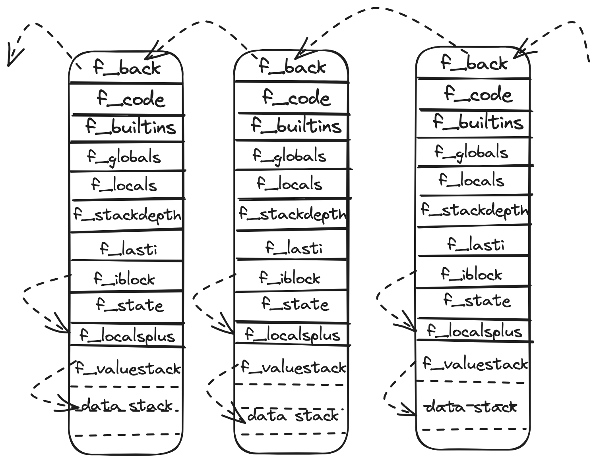
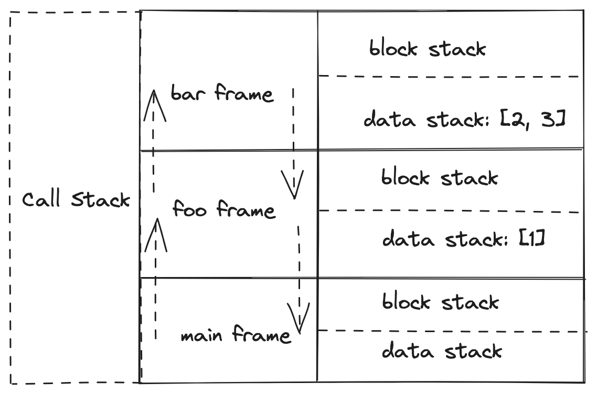

栈帧是Python虚拟机执行的载体之一，它是一个数据结构，用于存储代码运行时的数据。每个栈帧都有自己的局部变量、操作数栈、异常处理信息等。栈帧是一个栈结构，每个栈帧都有一个指向上一个栈帧的指针，这样就形成了一个栈帧链。

栈帧的创建和销毁是由Python虚拟机自动完成的，当一个函数被调用时，就会创建一个栈帧，当函数返回时，就会销毁这个栈帧。

栈帧的数据结构如下：

```c
typedef struct _frame PyFrameObject;

struct _frame {
    PyObject_VAR_HEAD
    struct _frame *f_back;      /* previous frame, or NULL 前一个栈帧 */
    PyCodeObject *f_code;       /* code segment */      // 代码段
    PyObject *f_builtins;       /* builtin symbol table (PyDictObject) 内置符号表，字典 */
    PyObject *f_globals;        /* global symbol table (PyDictObject) 全局符号表 字典 */
    PyObject *f_locals;         /* local symbol table (any mapping)  当前作用域 映射 */
    PyObject **f_valuestack;    /* points after the last local */   // 指向最后一个局部变量的后面
    PyObject *f_trace;          /* Trace function */    // 跟踪函数
    int f_stackdepth;           /* Depth of value stack */  // 值栈深度
    char f_trace_lines;         /* Emit per-line trace events? */ // 每行跟踪事件
    char f_trace_opcodes;       /* Emit per-opcode trace events? */ // 每个操作码跟踪事件

    /* Borrowed reference to a generator, or NULL */
    PyObject *f_gen;        // 生成器

    int f_lasti;                /* Last instruction if called */    // 最后一条指令
    int f_lineno;               /* Current line number. Only valid if non-zero */   // 当前行号
    int f_iblock;               /* index in f_blockstack */ // f_blockstack的索引
    PyFrameState f_state;       /* What state the frame is in 状态 */   // 栈帧的状态
    PyTryBlock f_blockstack[CO_MAXBLOCKS]; /* for try and loop blocks  */   // try 和 loop 块，长度为CO_MAXBLOCKS=20
    PyObject *f_localsplus[1];  /* locals+stack, dynamically sized */   // 局部变量和栈，动态地长度
};
```

每个栈帧都有自己的数据栈，数据栈的长度是动态的，它的长度是局部变量的数量加上栈帧的深度。局部变量的数量是由代码对象的co_nlocals属性决定的，栈帧的深度是由代码对象的co_stacksize属性决定的。



f_code 是代码段，它是一个PyCodeObject对象，它包含了代码对象的所有信息，包括字节码、常量表、变量名等。

f_builtins 是内置符号表，它是一个PyDictObject对象，它包含了内置函数的名称和函数对象的映射关系。

f_globals 是全局符号表，它是一个PyDictObject对象，它包含了全局变量的名称和变量值的映射关系。

f_locals 是局部符号表，它是一个PyDictObject对象，它包含了局部变量的名称和变量值的映射关系。

f_valuestack 是值栈，它是一个PyObject对象的数组，它包含了局部变量和操作数栈的值。

```python
a = 1
b = 3
c = a + b
print(c)
```


Python的调用栈有多个栈帧组成，一定包含main栈帧，main栈帧是Python虚拟机启动时创建的，它的f_back指针为NULL，其它栈帧的f_back指针都指向上一个栈帧。

```python
def bar(y):
    x = y + 3
    return x

def foo():
    a = 1
    b = 2
    return a + bar(b)

foo()
```

main栈帧调用foo栈帧，foo栈帧调用bar栈帧，bar栈帧返回到foo栈帧，foo栈帧返回到main栈帧。每一个返回都会销毁一个栈帧。程序结束，main栈帧也会被销毁。


