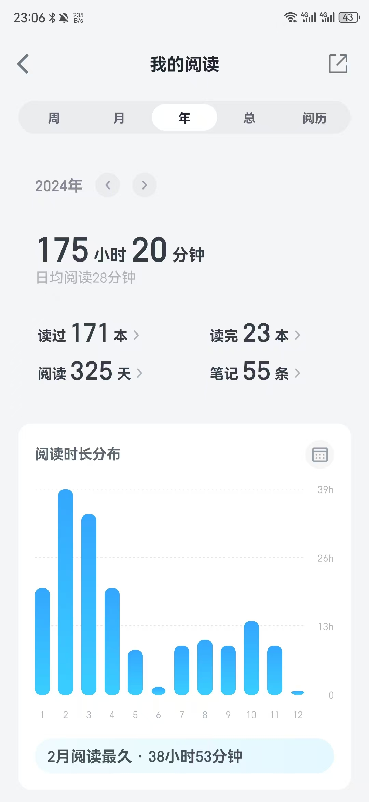
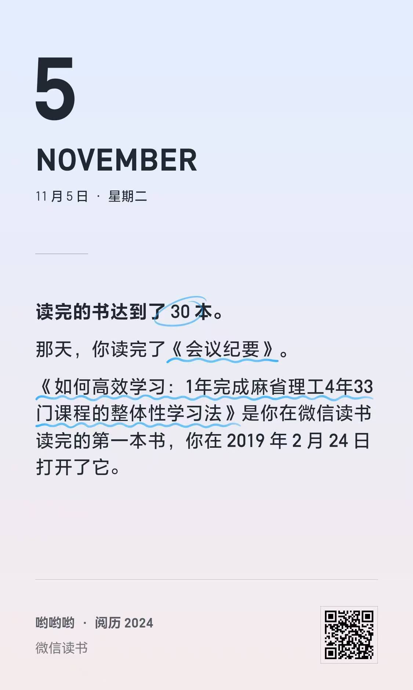
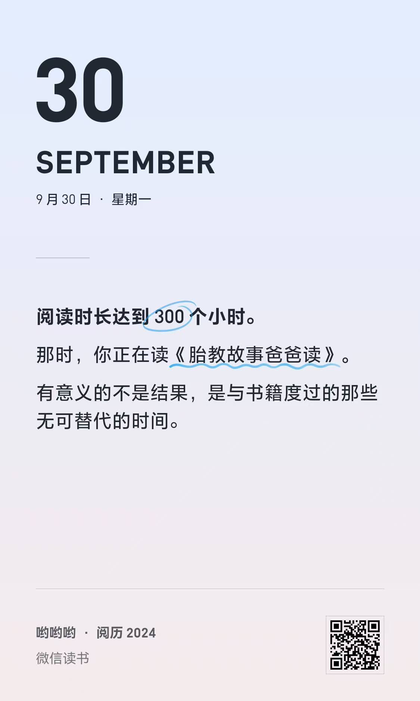
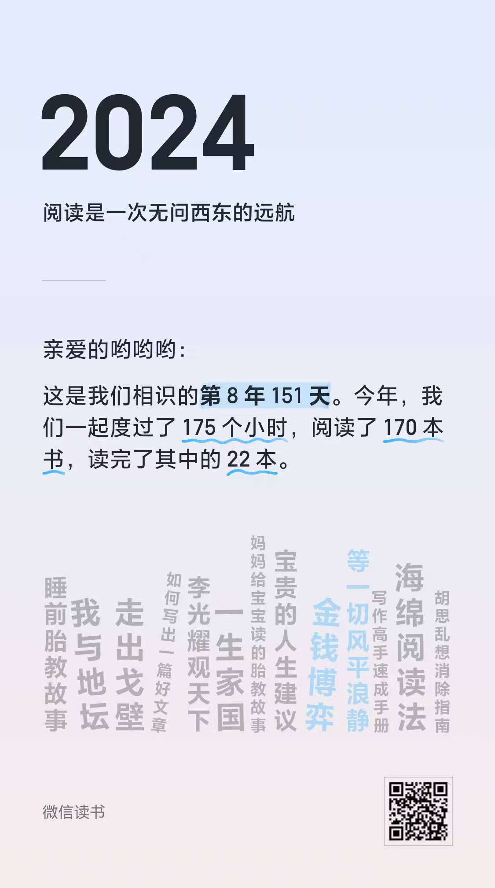
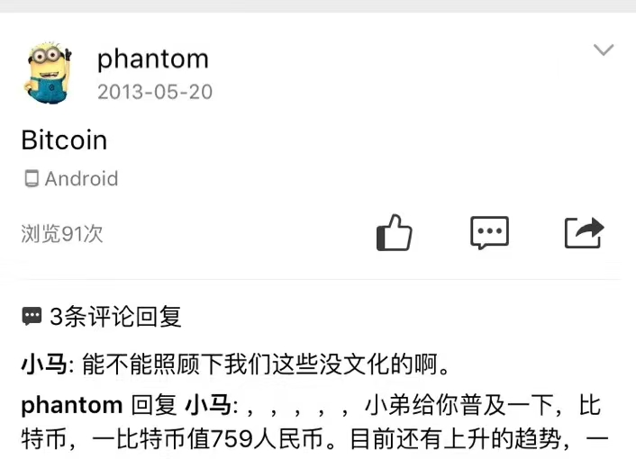
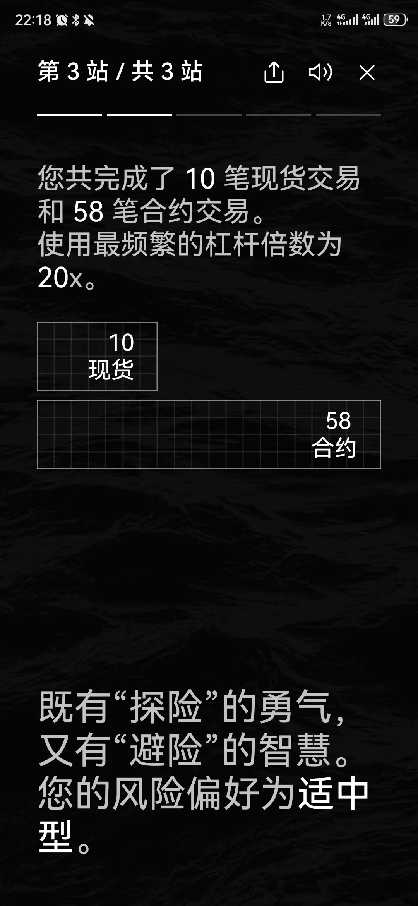
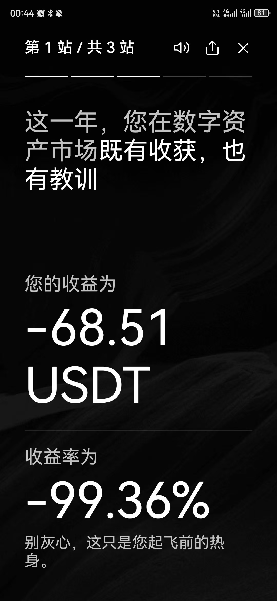
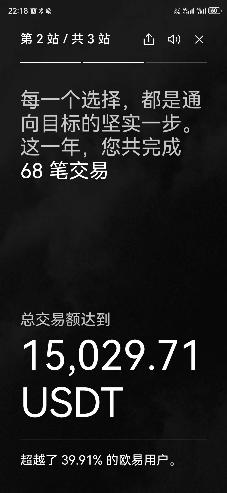

# 2024 年度总结

每年都应该有个年度总结，一方面是对自己的一年进行总结，另一方面是对未来一年进行规划。2024 年也不例外。

## 技术分析与写作

写作是一种思考方式，也是一种表达方式。2024 年大部分学习的时间花费在编译原理上，对 Python 内核代码的实现做了一系列分析；将工作上遇到问题的一些解决思路，总结之后写成博客；当然也包括一些书籍的读后感；用随笔的写作方式记录一些想法和思考。

写作这件事也算是坚持了一段时间，有了些许习惯，但始终有些潦草随性，好的文章需要反复推敲，然后以通俗易懂，简单明了的方式表达出来，能够让读者很快明白我的是什么，特别是技术分析之类的说明文章。

如果写作带有一丝功利心，那便失去了意义。刚开始的时候想着写一些技术类的分析文章，吸引读者，付费阅读，或者展示平台的广告，通过阅读流量赚取微薄的广告报酬。随着时间的推移我便很快的明白了一些道理。功利心的萌生，便是追求产出数量而忽略质量的开始，写作的心思和精力会转移到如何推广盈利上。这违背了我的初衷，得不到预期的结果也使得我变得焦虑。

当然，这一年也有少量的读者愿意为知识付费，我很感激他们，这也给了我不少动力，让我坚持输出与表达。

以上便是我这一年来在写作上的一些总结，欠缺的部分希望能在新的一年里有所进步，也希望自己怀揣初心坚持下去。

## 阅读

2024 年充值了微信读书的会员，从平台统计今年花费了 175 小时 20 分钟，读过 171 本书，读完 23 本，阅读 325 天，写下 55 条笔记。平均每天能有半个小时的阅读时间，我对这个时间还是比较满意，毕竟这都是我挤出来的时间，摸鱼的时间看书，逛街的时候看书，其它时间都被其它重要的时间充斥着。

阅读书籍的种类很广，计算机相关、经济类、励志类、文学、还有一些胎教阅读之类的书籍。

计算机相关的电子书（英语版）也是我阅读的一部分，一方面寻求最原始的表达，另一方面为了提升自己英语阅读水平。

学习英语是 2024 年的一个小插曲，完成了语法的学习后边搁置了，因为实在是没有挤不出时间来，而且应用场景受限制。希望 2025 年能重新拾起，加强阅读理解、口语、听力、写作的实践。

## 工作

一成不变的便是工作了，两点一线，反反复复。留下来不肯改变有以下几个原因：
1. 通勤时间分钟级
2. 轻松胜任自己的工作内容，有大量的时间可以学习和实践新的技术
3. 所在城市，这份工作算得上体面，权衡之下，可能是最优解
4. 自由职业的推进没有起色，也便自己的无奈

坐在办公室里，确实会让我变得焦虑，精神萎靡，我虽然喜欢做开发，但是业务开发翻来覆去就那么点东西，虽然开发过程中会使用”辅助编程“等工具，以及写一些脚本来生成代码。这些方法大大提升了我工作的效率，但也让我感到无趣，这些不足以满足我的成就感，远低于解决一个线上 bug，或者优化一个功能。

## 旅游

2024 年，唯一的一次旅游是三月份去西安，回来之后就真的没有时间再出去了。旅游无非就是吃吃喝喝，去历史景点，拍拍照打打卡。顺便看了陈奕迅演唱会，会见了在北京的同事兼好友飞哥。这次旅行搞得精疲力尽，主要是走了很多的路。

旅游除了累，好处也蛮多的，一方面可以锻炼自己突然来到陌生环境的适应能力，另一方面可以看到不一样的人文，学习当地的风俗习惯，以及一些历史知识和传承，开阔眼界。

## 个人事业

独立开发的推进没有起色，让我无奈的选择了坐班，也让自己陷入了内容。”个人事业“说得有点高尚了，说白了就是副业。这一年来有几个尝试的方向：
1. 知识付费
2. 站点 SEO 优化，通过 Google Adsense 赚取美金
3. 售卖软件
4. 外包。这一年来几乎不再接任何外包，主要的原因是耗费时间和精力，这毕竟不是一个持久而稳定的事情，不能为我带来”睡后收入“。

## 投资理财

2024 年加密货币持续火热，随着 BTC 达到 10 万美元一个，更是让很多人蠢蠢欲动。从 2013 年开始关注比特币，也是持续看好，但是 700 多块钱对于我来说，这差不多是我一周还是半个月的生活费。当然这都是后话了，能不能把持住也不好说。

从北京回来，一方面收入大打折扣，消费习惯没有适应新的环境，导致自己手里没有什么余钱。所以不存在什么理财，或者储蓄复利之类的说法。

进入加密货币的念头来源于自己的不切实际以及贪念，渴望百倍千倍的获利，直接躺平。加密货币什么事情都可能发生，可以一夜财富自由，也可以一夜之间一贫如洗。明明知道这是大的”庞氏骗局“，但仍想花点心思进去了解一下。11 月上旬，通过 C2C 方式入金 500 块人民币换得 60 多 USDT。现货并不能满足我的欲望，20x、50x、100x 的合约杠杆给我带来了无限的刺激。K 线的跳动，带动着我心跳，时而加速，时而舒缓。

最终我战胜了自己，这一次的入金到最后归零给自己深深的上了一堂课，这 500 块便是自己上缴的学费。人类的贪念无法控制，加密货币水深火热，尽量不要玩，并不是每个人都能得到上天的眷顾。最后嘱咐，千万不要玩合约。

## 育儿

2024 年，儿子的到来让我有点措手不及，我甚至还没做好当父亲的准备。一方面是经济上的问题，另一方面是自己时间和精力方面，我需要花费大量的时间和精力去弥补经济上的落差，所以我害怕自己没有能力去安护老婆的情绪和照顾新生儿。生产是一个复杂的过程，会给孕妇的身体和精神带来很多的影响，这一年来，老婆辛苦了。

知道”有了“这个件事有点不按套路。那天我下班，老婆不知道吃什么，做饭、外卖等等想了很多，最终敲定了去吃楼下烧烤，点完菜，由于有一个比较重要的会议我需要回来处理一下，猛然在桌子上发下了验孕棒”两条杠“，我通过搜索再次确认了一下，惊喜万分，下楼之后我跟老婆再次确认，心中的喜悦难以消退。现在回想起来我是不是太早发现了，我本应该让老婆第一时间看到我的表情。

新生儿的诞生，我几乎全部的精力放在了他和宝妈身上。宝妈产后恢复，以及新生儿的喂养和照顾是我重要关注的部分，四号不得松懈，以至于一度影响到精神状态，茶饭不思。

育儿是个持续的过程，也是学习新知识的开始。孩子的健康、教育等等都是我未来需要关注的。当然，做好这些，我必须的先管理好自己。管理好自己的情绪、积蓄、持续学习、保持健康身体。

## 总结

2024 年，相比于平庸带来的焦虑，我收获了更多的幸福，这是幸福的一年。

2025 年。我在网上看到了两个比较有趣的表达式：
1. `1**3+2**3+3**3+4**3+5**3+6**3+7**3+8**3+9**3 = 2025`
2. `(20 + 25)**2 = 2025`

这么一来，2025 年是一个有意义的年份，希望我们的 2025 年更有意义。
