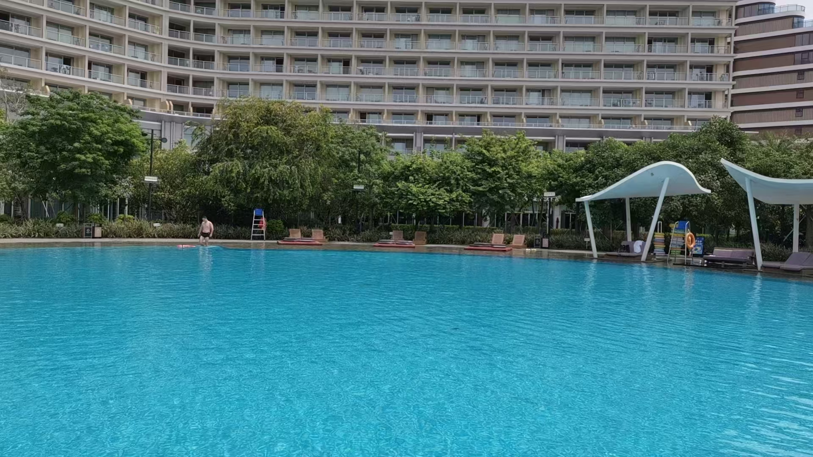
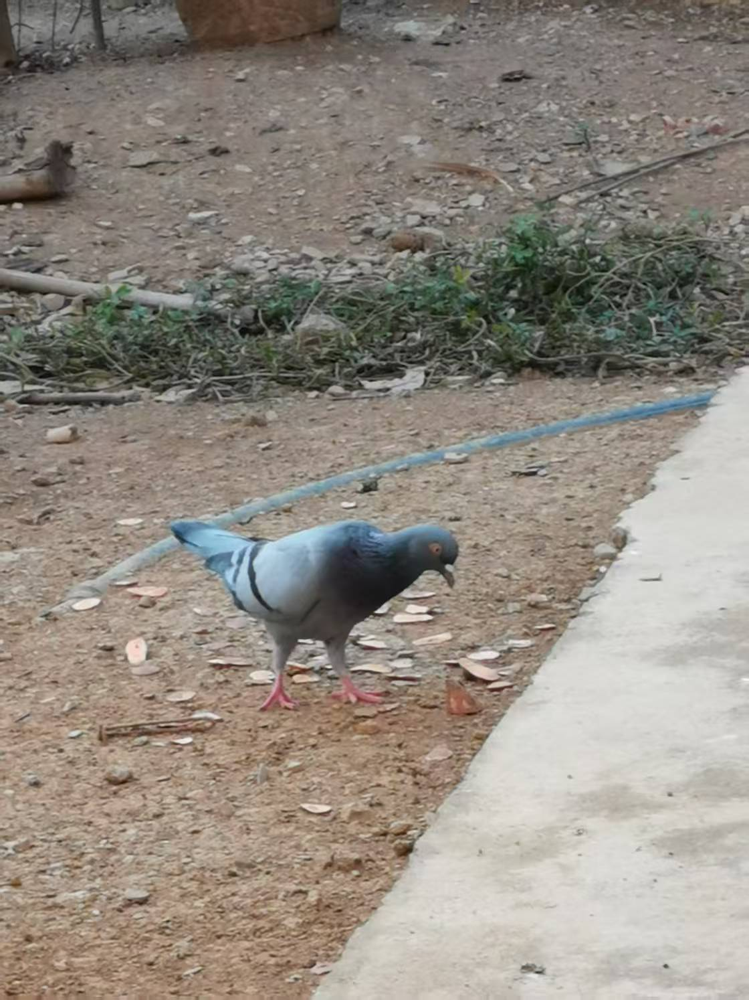
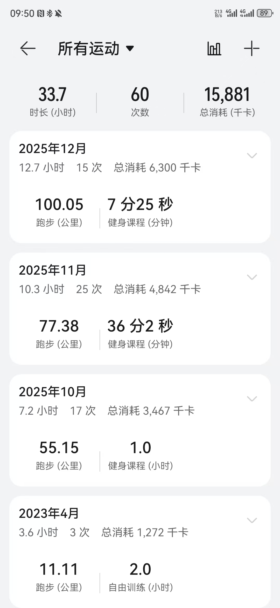

# 2025 年终总结

年末了，互联网各大 APP 开始推送年度报告。作为在互联网奋斗的人，不管是流于形式跟风，还是发自内心想把这一年记录一下，对我来说，这个总结必须写。

## 生活

`成年人的生活很单调，总是在做重复的事情。`

我也不例外。周内，早起喂奶，起床给娃做辅食，然后匆匆忙忙赶去上班，回来了吃完饭，陪娃玩一会儿，开始放水给娃洗澡，打打下手，收拾屋子，然后配奶，有时也会安抚娃娃睡觉。娃娃睡着之后就是自己的时间，有时跑步，有时做自己的工作或者学习一下，最后就是洗漱睡觉。周末唯一的不同之处是白天时间多，需要带娃多出去户外，增强远视储备。

虽然自己可以支配的时间变少了，但总体来看这是一件好事。

1. 每天玩手机的时间变少了，明白时间的重要性，更加珍惜时间
2. 更多的时间用来陪娃成长，这是一个幸福的过程，我很享受
3. 在有限时间内学习大量关于幼儿成长的知识，如：育儿知识；学习做美味的辅食，让娃娃食欲好，喜欢吃，长得好；发展娃娃的大运动能力，刺激感官发育等。
4. 成长离不开视频和照片的记录，也是娃娃的“御用摄影师”。照片拍得不好，仍需提升。

带娃难免会出现一些焦虑，比如娃的体重和身高长得不及其他同阶段的小孩、别人家的小孩学会了更多新的技能、过段时间婴儿感会消失、三岁之后就淘气了。

我当然明白提前焦虑是不对的，但是这句话是我之前作为局外人理解的。

## 旅游

今年出去旅游的次数少得可怜，一方面带着娃娃出去很不方便，总觉得带的东西远远不够，恨不得消毒柜也带上；一出门大包小包的，全是娃娃的东西，“嫌麻烦”，渐渐地也把“带他出去，他也记不下来什么”当成了借口。

其实真正的原因是：他还小，出远门风险系数高；长途跋涉折腾他，熟悉的环境发生了变化，不能确定他能不能开始适应；还有就是旅游目的地的医疗条件如何等等，有很多因素需要考虑。我记得出门清单都列了几十条。

今年就十一前去了一趟北海，待了 3、4 天，这是鼓足了勇气的一次。十一前的北海稍微有点儿热，紫外线强，白天基本在酒店休息，享受酒店丰盛的自助早餐，中午点上本地特色食物外卖，也有一两次打车出去吃。

上午在酒店的游泳池嬉戏，给他买了一个游泳圈和一身泳衣，总共花了 100 多，就用了一次，然后他就要睡午觉了，哈哈哈，无所谓，带回去，大点了再用。下午陪娃在酒店的儿童乐园玩耍。盘珠子，在海洋球池子里爬行，陪他攀爬到高处，拍拍照，录一下视频等等。

傍晚才会出去活动，这个时候温度降下来了，基本也就是出去解决晚饭问题。娃娃睡得比较早，以至于吃完晚饭就该考虑他要睡觉了，沿着海边的沙滩走回酒店，差不多也到了他要睡觉的时间了。

与其说带娃出去刺激他的感官，不如说是让自己放松一下，带他出去其实也没有想象的那么累。按时喂奶，照顾娃娃的安全就好了，其他时间想想吃什么、去哪里玩，没有工作的烦恼。有更多的时间休息，享受其他服务。

其实我很想每一次出去的经历写下来，这一次我又以很忙为借口“鸽了”。

十一前的“演练”让我有了更多的勇气带他远行了，十一回老家显得“游刃有余”。

## 运动

这一年没有打羽毛球，虽然公司每周五都会组织，也有些同事邀请我去，我都以“要带娃”推脱了。

人总得折腾一下。30 多岁了总想证明点什么，“自己还行”。

不知怎么的，总感觉今年全民运动，以及马拉松的推广力度变强了。身边的朋友最近几个月都参加了好几次半马。这一下激起了我的“斗志”。

10 月份开始跑步，截至今天，累计跑量 232 km，12 月份单月跑量达到 100 km，这算得上一个大进步了，往年都是断断续续，或者好几个月没动静。2025 年最后的三个月是我有史以来跑步最频繁、坚持最久的一段时间。

`我跟老婆说，10 年前我就喜欢跑步，但是没有坚持下来，如果我坚持下来和别人的差距就少 10 年。她说，现在开始也不迟，10 年后你和别人的差距仍是 10 年，也可能会缩短到 5-6 年，如果不坚持可能差距变成 20 年。`

马拉松最年轻的选手就 16 岁，最年长的有 70 多。所以这个年纪真的不晚也不迟。

其实跑步不一定是为了去参加马拉松，这只是顺手的一件事。本质是为了增加自己的心肺能力，有一个更加强健的身体守护家人。

在这件事上我必须感谢我的家人，没有他们的支持，我不可能坚持下来，还有这么多的时间来锻炼。娃娃总得有人来带，我没时间陪着，他们就需要付出更多的时间来陪伴他。

## 阅读

阅读少得可怜的一年，这一年基本没怎么看书，倒是 11、12 月份写了点东西。

英语学习和写作也落下了。强迫自己上班的时候去阅读一些英文文档，以至于还有部分“语感幸存”

## 工作

工作还是老样子，两点一线，单调乏味，没有升职，没有加薪，工作算是稳定，欣慰的同时，也保持着危机感。

今天听到最多的话题就是 AI 模型以及 AI 辅助编程。起初比较反感 AI。无非在有限的数据集里做最相近的搜索；自从出现了“推理”，我发现 AI 的发展已经超出了我的预期。

90 % 的问题都可以在网上找到解决方案，AI 同样可以做到：帮你梳理结构、总结，条理清晰，关键是还没广告，何乐不为，没有不用起来的理由。从开始抵触，到现在的“真香”定理，短短几个月大反转。

AI 的出现提升了编码速度，意味着工作效率得到了提升，有更多的时间可以“摸鱼”，做更多的事情。

AI 发展迅速，在辅助编程上，代码提示几乎可以做到实时，效果远超传统的代码提示和自动补全。传统的代码提示及补全，只能提示一些方法和命名；而 AI 辅助编程只需要提供一些简单的注释描述或方法名，就能够帮你推断出你想要实现的功能。当我看到提示内容后，眼前一亮，这不正是我要写的吗！

今年做了不少工具来提升工作效率，增强质量检查，其中一些工具对接了 AI 相关的 API。我的一个理念是：`能用工具自动化的，绝不手动重复操作。`

1. 容器部署相关的 Chrome 插件。能将 GitLab pipeline 构建的镜像快速发布到其他平台，以往需要在 GitLab 复制镜像链接，然后跳转到对应的项目发布 Docker 镜像；这个工具的出现，大大缩短了自己的操作流程，也得到了其他同事的肯定
2. gitx 是一个 Git 相关的工具集，将一些 Git 操作命令组合起来，减少重复命令集合的敲击，同时也包含一个用 AI 写 Git commit 记录的命令
3. Git server-side hook 的推行，检查接口文档的质量，拦截一些不规范代码的提交，拦截未解决的合并等等
4. 自动生成 HTTP 接口的 Python 测试用例，包含请求参数和响应的校验
5. 完善自己推行的文档系统，用 AI 生成其他端的接口请求、响应、参数校验等代码，Go、TypeScript、Java、Swift、C# 等，以及用 AI 生成 mock 数据
6. 写了很多的 Shell 脚本，以及 fish shell 的一些组合命令
7. 从 Excel 中提取多语言，处理字面变量问题，生成 Go、PHP 代码
8. 从设计文档中生成升级脚本相关代码，Go、PHP 请求参数以及响应数据结构，大幅度提升了开发效率

在工具推行的过程中，我发现别人对这些工具并不“感冒”，但是我确确实实感受到这些工具对我的工作效率有大幅提升。我对他们的反应很困惑，另一方面也让我失去了推行的积极性，毕竟我不能强迫别人使用它们。

## 理财

今年的理财观念发生了变化。结合自己的实际：可支配的本金太少，盈亏并不会太明显，可能需要花费大量时间来关注它，比如盯盘之类的，考虑何时买入、何时卖出。投入和回报不成正比。如果把这些时间用来投资自己，回报可以是百倍或者千倍。

脚踏实地，不要过分追求高回报，高回报意味着高风险，甚至会有失去本金的风险。投资需要有闲置的本金和超强的耐心。复利才是盈利的本质，否则容易陷入资本布局的陷阱。

---

2026 年的计划很简单：

1. 希望能挤出更多的时间来陪伴家人。增加收入，让后盾更加坚强，多带家人出去转转
2. 拥抱 AI。AI 真的能提高工作效率
3. 坚持跑步，拥有一个强健的体魄。参加一次半程马拉松
4. 有自己的事业
5. 坚持阅读

2025.12.31 
记
