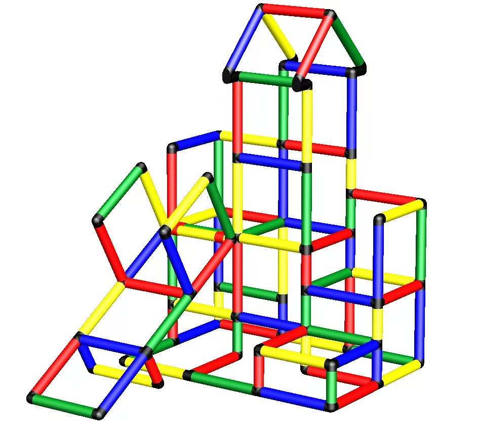
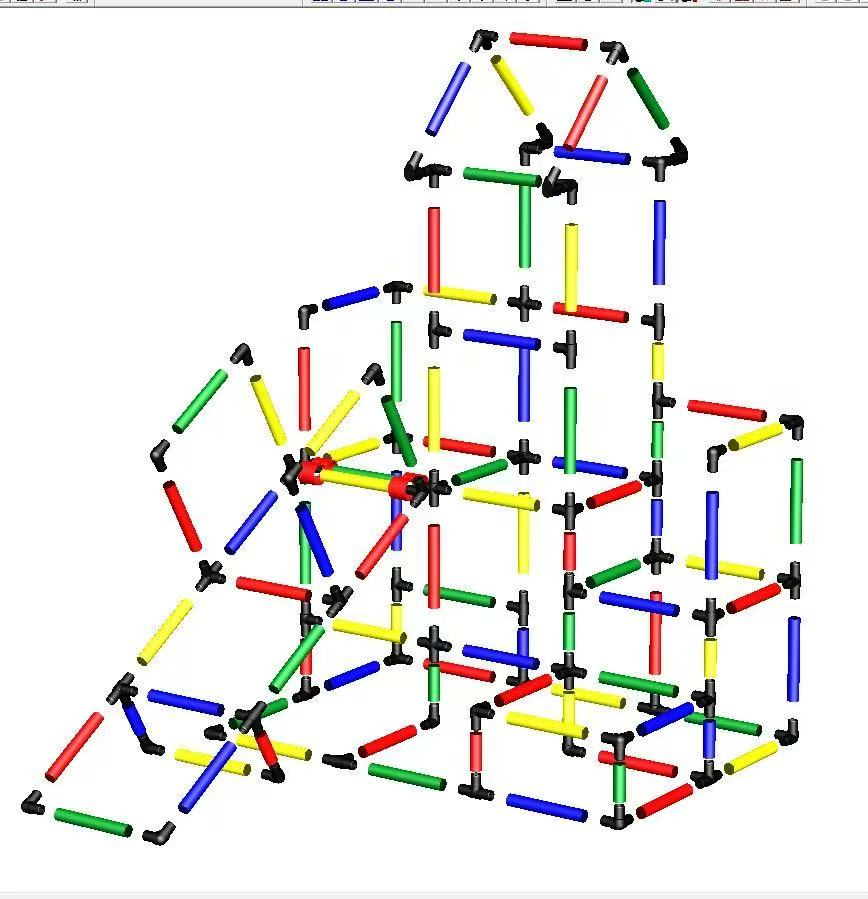

# 儿童攀爬架升级改造

新年伊始，不动手做点什么，总感觉差点意思。

娃娃的攀爬架第一次搭建至今已经半年了，但架构一直没有改变。对他来说，现在的攀爬难度已经降低了很多。老婆很早就提出要对其进行升级改造，我却一直以忙为“借口”，一拖再拖。

正逢假期，“改造”这个话题又被提起，我和家人一拍即合，立刻动起手来。我和老婆负责拆卸，娃娃的外婆把所有零件重新擦拭了一遍，新的搭建方案由我来执行。

幸好厂商提供了新的改造图纸，否则以我现在的空间想象能力，要完成这个任务还是有点难度的。

我处理问题时习惯用“动态规划”，攀爬架的改造也不例外。

先把整体拆分成多个子模块的组装任务。这样一来，一个改造任务就变成了多个小的组装任务：滑梯组装、三级阶梯拼接、阶梯承载模块拼接、屋顶搭建、平台挡板嵌入、整体拼接。最后，将所有管道连接处的螺丝拧紧。

`拼接过程中遇到了一次需要返工的步骤`。因为我把挡板、太空舱、洞洞板这一类零件的安装安排在最后，导致不得不拆卸部分管道，才能完成上述零件的嵌入。返工很不是滋味：一方面说明自己考虑不到位，另一方面浪费时间。

所以做任何事情都要先考虑清楚，顾全大局。比如接触到新电器时，先看看使用说明书；玩乐高之类的拼接玩具时，先熟悉每个零件的作用；读一本书前，先把大纲看一下，“先把一本书读薄，再读厚”；学习一门技术前，先将这门技术的基础知识熟悉一遍，然后动手配合思考；等等。

总而言之，处理问题时，先简单考虑整体，做一个详细的任务拆分，最后整体结合，细节化。
