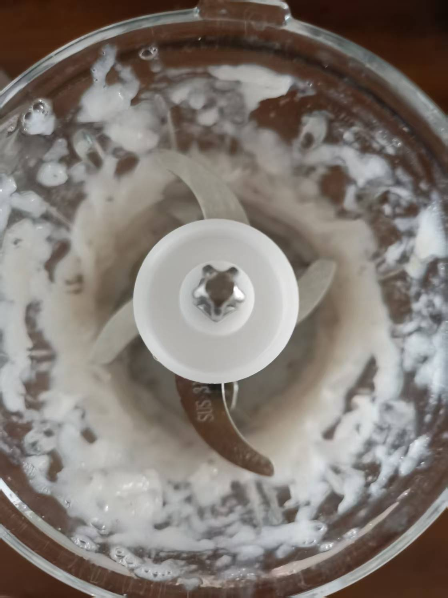
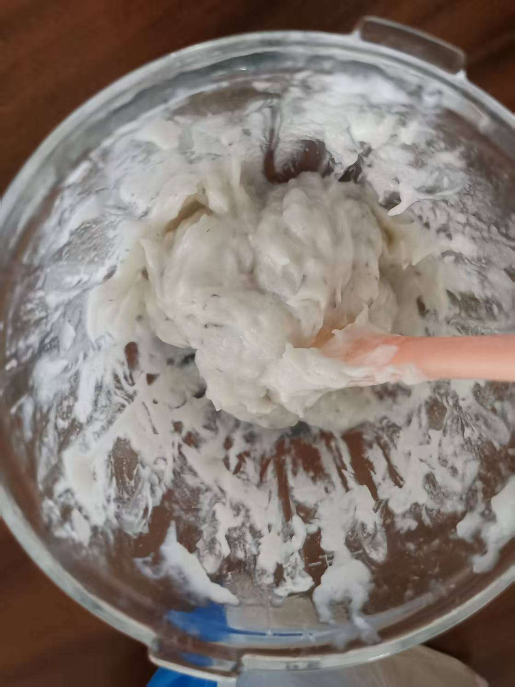
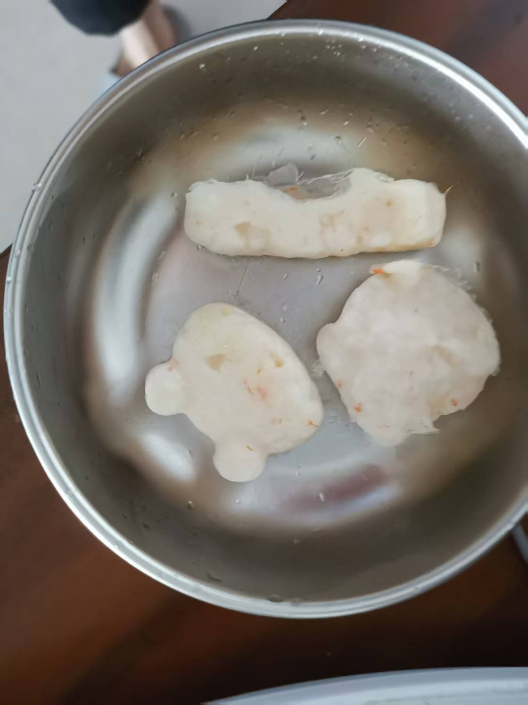
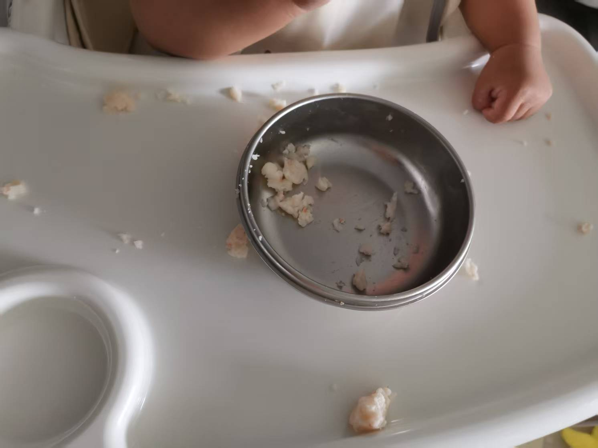

辅食虾糕制作需要的主要原材料：三四只虾，玉米低筋面粉。

虾可以选择新鲜的虾或者冻虾。由于平时忙，早上买新鲜的虾来制作，时间来不及。我选择了山姆的冻虾，一方面从众心理，另一方面“定价原则”，价格贵一点可能品质会好一点。

凉水浸泡解冻，解冻之后去虾头，虾壳，用牙签将腹部和背部的虾线剔除掉，反复洗净。切两三片姜浸泡虾肉去腥，浸泡 15 分钟左右。

取出虾肉，放入辅食机内，将虾肉打成泥状。取出辅食刀，加入少量温水，加入三勺玉米低筋面粉（奶粉勺大小），手动搅拌均匀，然后装入裱花袋内。

好看的食物需要辅食模具，增加宝宝的好奇，同时也可以增加食欲。

模具槽内刷入辅食油，防止成品和模具内壁粘黏。将装好虾肉泥的辅食模具放入锅内，盖上锅盖蒸 15 分钟左右，水沸之后开小火，15 分钟之后关火，焖 2 分钟左右。

取出虾糕，倒入辅食碗内，放凉之后就可以给宝宝吃了，宝宝吃之前自己先确认一下温度。

