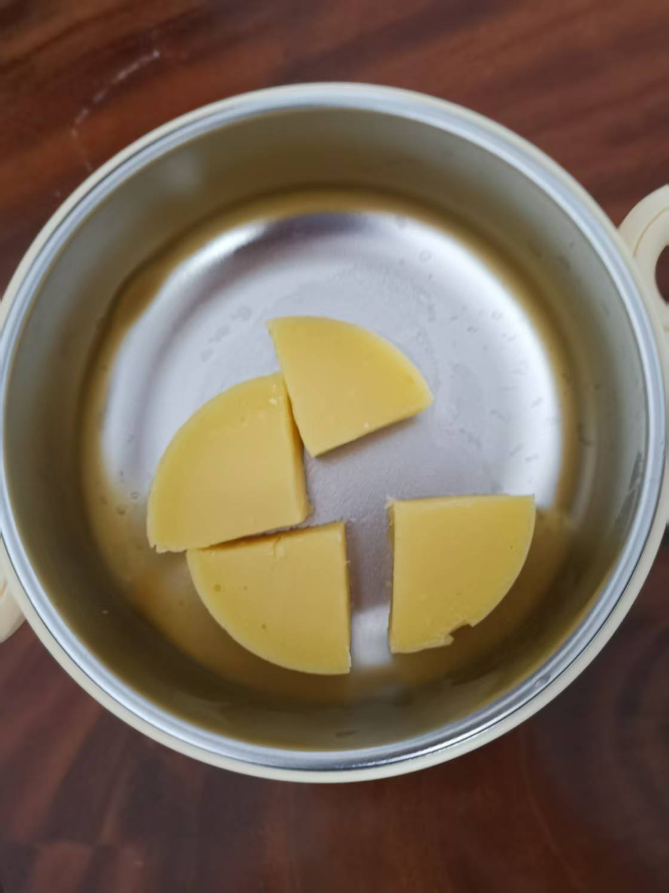

原材料：蛋黄和玉米粉，使用滤勺将蛋清过滤出来。<b>一岁前婴儿不宜食用蛋白（蛋清）</b>

> 一方面：过敏风险较高，蛋清中的蛋白质（如卵白蛋白、溶菌酶等）属于常见过敏原，另一方面：消化系统不成熟，婴儿的肠道通透性较高，消化酶（如胃蛋白酶、胰蛋白酶）分泌不足，难以完全分解蛋清中的复杂蛋白质，可能导致未消化的蛋白质进入血液，引发过敏或不耐受。

蛋黄蒸糕的制作相对简单。蛋黄加温水搅拌均匀，加入三勺玉米低筋面粉搅拌均匀，如果还是比较粘稠，可以再加入适量的温水脚本，直到舀起来成滴状落下。

玻璃辅食碗内刷入辅食油，倒入搅拌后的蛋黄，轻轻上下震荡玻璃辅食碗，将辅食均匀持平。放入蒸锅中蒸 15 分左右（水沸之后开小火），关火焖 2 分钟左右。

给宝宝吃之前需要自己尝试，需要考虑食物的硬度，温度等等，确认可以吃了之后才给宝宝吃。

由于做好的时候，宝宝睡着了。出门上班之前跟妈说，等宝宝醒来了再给他吃。上班的时候，妈反馈给我如下：

> 没有吃，都扔了，吃不动，像石头一样

这是一次失败的尝试。接下会对该辅食的制作流程进行调整，解决食物的硬度，使其更蓬松。